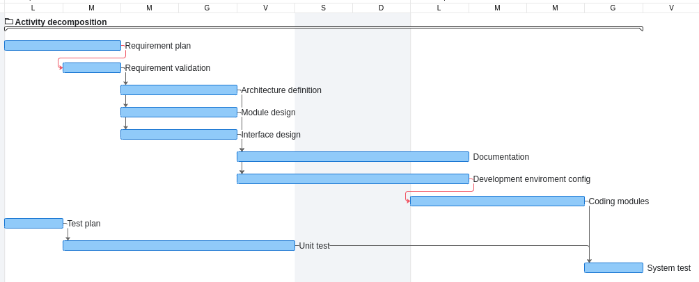

# Project Estimation - FUTURE
Date: 28/04/2023

Version: V2

# Estimation approach

Consider the EZWallet  project in FUTURE version (as proposed by the team), assume that you are going to develop the project INDEPENDENT of the deadlines of the course

# Estimate by size

|             | Estimate                        |             
| ----------- | ------------------------------- |  
| NC =  Estimated number of classes to be developed   |       7                      |             
| A = Estimated average size per class, in LOC       |             300               | 
| S = Estimated size of project, in LOC (= NC * A) |   2100  |
| E = Estimated effort, in person hours (here use productivity 10 LOC per person hour)  |                    210                  |   
| C = Estimated cost, in euro (here use 1 person hour cost = 30 euro) |  6300  | 
| Estimated calendar time, in calendar weeks (Assume team of 4 people, 8 hours per day, 5 days per week ) |          1.2          |               

# Estimate by product decomposition

|         component name    | Estimated effort (person hours)   |             
| ----------- | ------------------------------- | 
|requirement document    |  30  |
| GUI prototype |  20  |
|design document |  25  |
|code |   90   |
| unit tests |   90   |
| api tests |  60   |
| management documents  |  40  |

# Estimate by activity decomposition

|         Activity name    | Estimated effort (person hours)   |             
| ----------- | ------------------------------- | 
| requirements plan | 45 |
| requirements validation | 12 |
| architecture definition | 25 |
| module design | 30 |
| interface design | 15 |
| documentation | 30 |
| developmentd enviroment configuration | 20 |
| coding modules | 70 |
| test plan | 10 |
| unit test | 80 |
| system test | 45 |

# Gantt chart

| ID |        Activity name    | Duration (Day)   | Start Finish | Predecessor |            
| ---- | ------- | ------- | ------- | ----------------- | 
| 1 | requirements plan | 2 | 03/04  04/04 | |
| 2 | requirements validation | 1 | 04/04  04/04 | 1 |
| 3 | architecture definition | 2 | 05/04  06/4 | 2 |
| 4 | module design | 2 | 05/04  06/04 | 2 |
| 5 | interface design | 2 | 05/04  06/04 | 2 |
| 6 | documentation | 2 | 07/03  10/04 | 3, 4, 5 |
| 7 | developmentd enviroment configuration | 2 | 07/04  10/04 | 3, 4, 5 |
| 8 | coding modules | 3 | 10/04  12/04 | 6, 7 |
| 9 | test plan | 1 | 03/04  03/04 | |
| 10 | unit test | 4 | 04/04  07/04 | 9 |
| 11 | system test | 2 | 13/04  13/04 | 8, 10 |

# Summary

|             | Estimated effort                        |   Estimated duration |          
| ----------- | ------------------------------- | ---------------|
| estimate by size |  210  |  1.2  |
| estimate by product decomposition | 355 |  1.6  |
| estimate by activity decomposition | 382 | 1.7 |

As for v1, estimate based on code size is shorter because it doesn't take into account all aspect of activities necessary to complete the project. The others esimates take into account more factor such as planning, design, documentation, ecc, resulting in an higher effort estimate.

