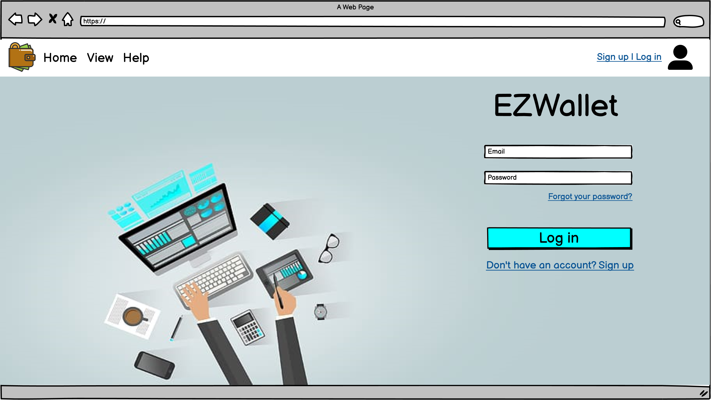
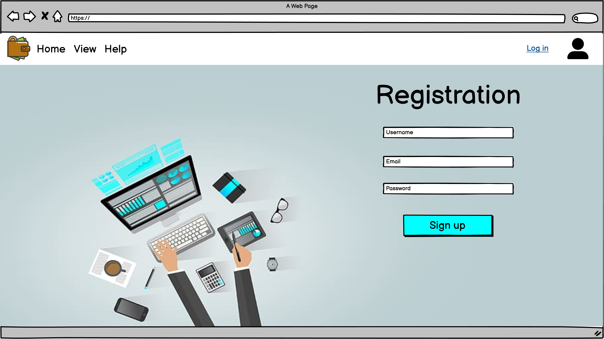
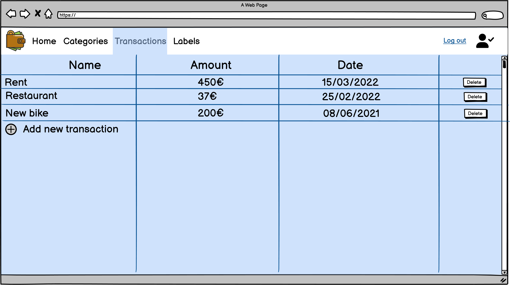
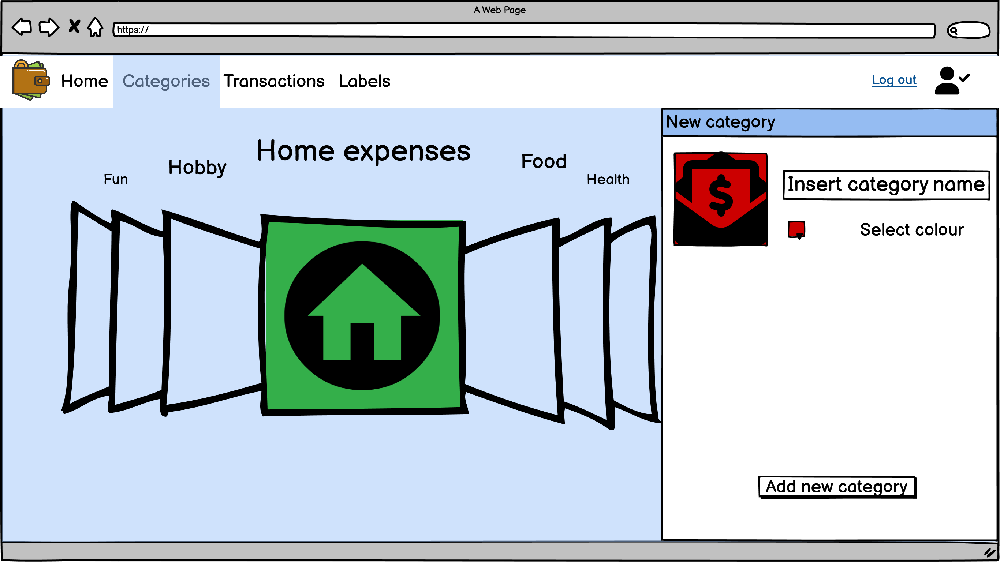
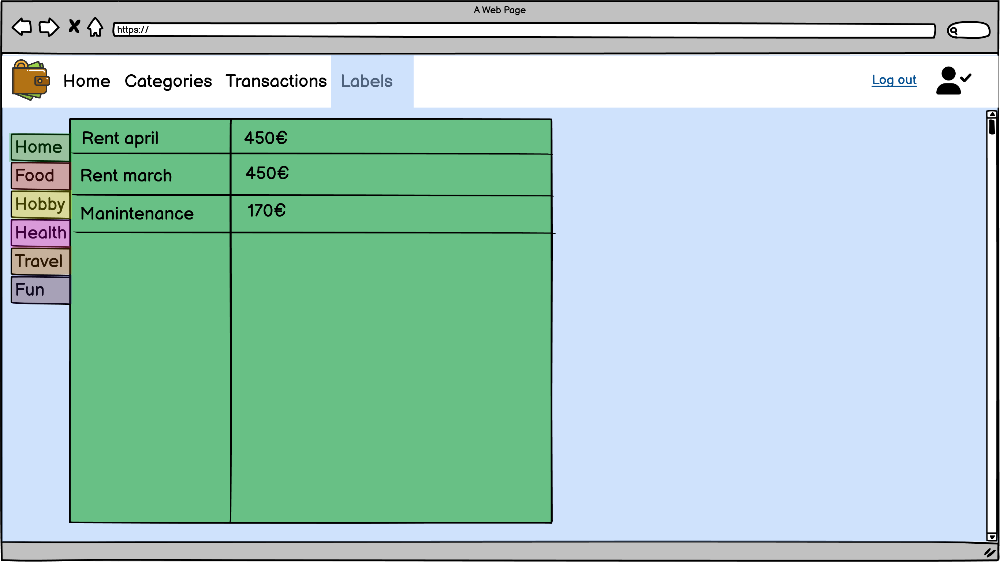
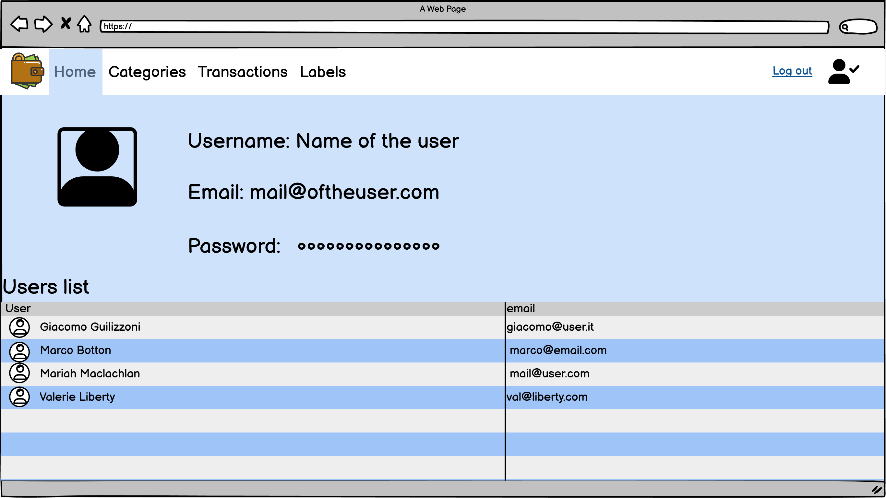

# Graphical User Interface Prototype - CURRENT

Authors: Group 63

Date: 28/04/2023

Version: v1 (desktop)

## Use case 1, UC1: Login - Use case 3, UC3: Logout

- Scenario 1.1 - 1.2 - 1.3 - 1.4

## Use case 2, UC2: Register

- Scenario 2.1 - 2.2

## Use case 4, UC4: Getting User data - Use case 7, UC7: Add a transaction - Use case 8, UC8: Get transaction - Use case 9, UC9: Delete a transaction

- Scenario 4.1 - 4.2 - 4.3 
- Scenario 7.1
- Scenario 8.1
- Scenario 9.1

## Use case 5, UC5: Create a category - Use case 6, UC6: Get category list

- Scenario 5.1
- Scenario 6.1

## Use case 8, UC8: Get transaction

- Scenario 8.2

## Use case 4, UC4: Getting User data

- Scenario 4.4
