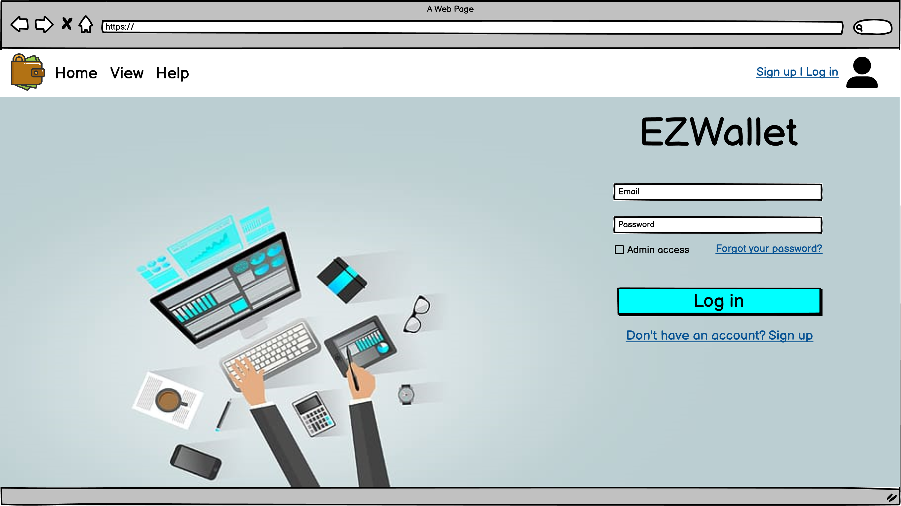
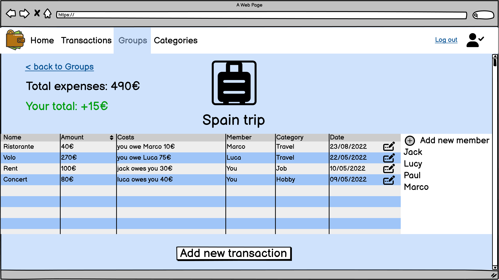

# Graphical User Interface Prototype - FUTURE

Authors: Group 63

Date: 28/04/2023

Version: v2 desktop and mobile GUI

## Use case 1, UC1: Login 

## Use case 2, UC2: Register 

## Use case 3, UC3: Logout - Use case 4, UC4: Get user data - Use case 5, UC5: Modify user data - Use case 7, UC7: Delete user account

## Use case 6, UC6: Admin deletes user account 

## Use case 8, UC8: Create category - Use case 9, UC9: Get category list - Use case 10, UC10: Update category - Use case 11, UC11: Delete category

## Use case 12, UC12: Add a transaction - Use case 13, UC13: Get a transaction - Use case 14, UC14: Delete a transaction - Use case 15, UC15: Update a transaction - Use case 16, UC16: Display transaction charts

## Use case 17, UC17: Create a group - Use case 18, UC18: Update a group - Use case 19, UC19: Delete a group

## Use case 20, UC20: Create personal budget - Use case 21, UC21: Update personal budget

## Use case 1, UC1 - Use case 2, UC2 - Use case 3, UC3 - Use case 4, UC4 - Use case 5, UC5 - Use case 7, UC7

## Use case 8, UC8 - Use case 9, UC9 - Use case 10, UC10 - Use case 11, UC11

## Use case 8, UC8 - Use case 9, UC9 - Use case 10, UC10 - Use case 11, UC11

## Use case 12, UC12 - Use case 13, UC13 - Use case 14, UC14 - Use case 15, UC15 - Use case 16, UC16

## Use case 17, UC17 - Use case 18, UC18 - Use case 19, UC19 - Use case 20, UC20 - Use case 21, UC21

