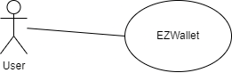
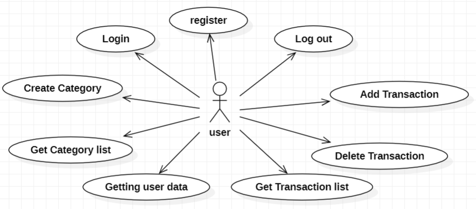
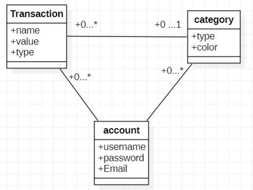
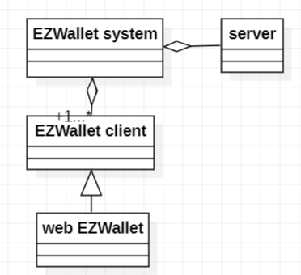
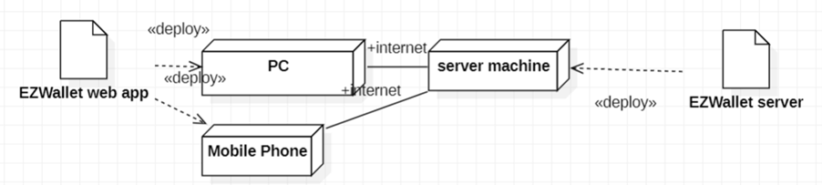

# Requirements Document - current EZWallet

Date: 28/04/2023

Version: V1 - description of EZWallet in CURRENT form (as received by teachers)

| Version number | Change |
| ----------------- |:-----------|
|1| | 

# Contents

- [Informal description](#informal-description)
- [Stakeholders](#stakeholders)
- [Context Diagram and interfaces](#context-diagram-and-interfaces)
	+ [Context Diagram](#context-diagram)
	+ [Interfaces](#interfaces) 
	
- [Stories and personas](#stories-and-personas)
- [Functional and non functional requirements](#functional-and-non-functional-requirements)
	+ [Functional Requirements](#functional-requirements)
	+ [Non functional requirements](#non-functional-requirements)
- [Use case diagram and use cases](#use-case-diagram-and-use-cases)
	+ [Use case diagram](#use-case-diagram)
	+ [Use cases](#use-cases)
    	+ [Relevant scenarios](#relevant-scenarios)
- [Glossary](#glossary)
- [System design](#system-design)
- [Deployment diagram](#deployment-diagram)

# Informal description
EZWallet (read EaSy Wallet) is a software application designed to help individuals and families keep track of their expenses. Users can enter and categorize their expenses, allowing them to quickly see where their money is going. EZWallet is a powerful tool for those looking to take control of their finances and make informed decisions about their spending.

# Stakeholders

| Stakeholder name  | Description | 
| ----------------- |:-----------:|
|User|End user of the application|
|Startup|Developer and provider of the application|

# Context Diagram and interfaces

## Context Diagram

## Interfaces
| Actor | Logical Interface | Physical Interface  |
| ------------- |:-------------:|:-----:|
|User|GUI|Smartphone/PC|

# Stories and personas
_Persona 1_: young professional, female, 24
- Story: started to work and wants to track new cash flow (earnings + expenses).

_Persona 2_: high income, male, 45
- Story: never tracked expenses. Wants to track expenses and cut non necessary ones in order to save some money for a new car.

_Persona 3_: low income, male, student, 21
- Story: having a tight budget, wants to know exactly how he spends money.

# Functional and non functional requirements

## Functional Requirements

| ID        | Description  |
| ------------- |:-------------:| 
|FR1|Manage accounts|
|FR1.1|Get users|
|FR1.2|Login-logout|
|FR2|Manage categories|
|FR2.1|Get categories|
|FR2.2|Create category|
|FR3|Manage transactions|
|FR3.1|Get transactions|
|FR3.2|Create transaction|
|FR3.3|Delete transaction|
 
## Table of access rights
||**User**|
| ------------- |:-------------:| 
|FR1|yes|
|FR2|yes|
|FR3|yes|

## Non Functional Requirements

|ID|Type|Description|Refers to|
| ------------- |:-------------:| :-----:| :-----:|
|NRF1|Usability|Usable by a user with at least 6 months of experience|FR1, FR2, FR3|
|NRF2|Efficiency|Functions should be done in less than 0.3 seconds|FR1, FR2, FR3|
|NRF3|Security|Non authorized user should not be able to use the application|FR1, FR2, FR3|
|NRF4|Availability|Downtime should be 1h/year|FR1, FR2, FR3| 

# Use case diagram and use cases

## Use case diagram

- [Login](#use-case-1-uc1-login)
- [Register](#use-case-2-uc2-register)
- [Logout](#use-case-3-uc3-logout)
- [Get user data](#use-case-4-uc4-getting-user-data)
- [Create a category](#use-case-5-uc5-create-a-category)
- [Get category list](#use-case-6-uc6-get-category-list)
- [Add a transaction](#use-case-7-uc7-add-a-transaction)
- [Get transaction list](#use-case-8-uc8-get-transaction)
- [Delete a transaction](#use-case-9-uc9-delete-a-transaction)

## Use cases

### Use case 1, UC1: Login
|Actors Involved|User, System|
| ------------- |:-------------:| 
|Precondition|User is not authorized|
|Post condition|User is authorized|
|Nominal Scenario|User enters by email and password (Scenario 1.1)|
|Variants|Scenario 1.4|
|Exceptions|Scenario 1.2, 1.3|

#### Scenario 1.1 

| Scenario 1.1 | |
| ------------- |:-------------:| 
|Precondition|User is not logged in|
|Post condition|User is logged in|
|Step#|Description|
|1|User requests for login|  
|2|System asks for email and password|
|3|User inserts email and password|
|4|System authorizes the user after checking email and password|

#### Scenario 1.2

| Scenario 1.2 | |
| ------------- |:-------------:| 
|Precondition|User is not logged in|
|Post condition|User is not logged in|
|Step#|Description|
|1|User requests for login|  
|2|System asks for email and password|
|3|User inserts email and password|
|4|System checks, aborts operation, password is wrong|

#### Scenario 1.3

| Scenario 1.3 | |
| ------------- |:-------------:| 
|Precondition|User is not logged in|
|Post condition|User is not logged in|
|Step#|Description|
|1|User requests for login|  
|2|System asks for email and password|
|3|User inserts email and password|
|4|System checks, aborts operation, entered email does not exist|

#### Scenario 1.4

| Scenario 1.4 | |
| ------------- |:-------------:| 
|Precondition|User is not logged in|
|Post condition|User is already logged in|
|Step#|Description|
|1|User requests for login|  
|2|System asks for email and password|
|3|User inserts email and password|
|4|System checks, aborts operation, entered email is already authorized|

### Use case 2, UC2: Register
|Actors Involved|User, System|
| ------------- |:-------------:| 
|Precondition|User has no account|
|Post condition|User has an account|
|Nominal Scenario|User makes a new account using email, username and password (Scenario 2.1)|
|Variants|-|
|Exceptions|Scenario 2.2|

#### Scenario 2.1

| Scenario 2.1 | |
| ------------- |:-------------:| 
|Precondition|User has no account|
|Post condition|User has an account|
|Step#|Description|
|1|User asks for register|  
|2|System asks for email|
|3|User enters email|
|4|System checks email|
|5|System asks for username|
|6|User enters a username|
|7|System asks for a password|
|8|User enters a password|
|9|System stores the new account|

#### Scenario 2.2

| Scenario 2.2 | |
| ------------- |:-------------:| 
|Precondition|User has no account|
|Post condition|User already has an account|
|Step#|Description|
|1|User asks for register|  
|2|System asks for email|
|3|User enters email|
|4|System checks email|
|5|System checks, aborts operation, email already exists in system|

### Use case 3, UC3: Logout
|Actors Involved|User, System|
| ------------- |:-------------:| 
|Precondition|User is logged in|
|Post condition|User is logged out|
|Nominal Scenario|User requests for log out (Scenario 3.1)|
|Variants|-|
|Exceptions|Scenario 3.2, 3.3|

#### Scenario 3.1

| Scenario 3.1 | |
| ------------- |:-------------:| 
|Precondition|User is logged in|
|Post condition|User is logged out|
|Step#|Description|
|1|User asks for logging out|  
|2|System checks tokens|
|3|User is logged out|

#### Scenario 3.2

| Scenario 3.2 | |
| ------------- |:-------------:| 
|Precondition|User is logged in|
|Post condition|User is logged out|
|Step#|Description|
|1|User asks for logging out|  
|2|System checks tokens|
|3|User has no token (is already logged out)|

#### Scenario 3.3

| Scenario 3.3 | |
| ------------- |:-------------:| 
|Precondition|User is logged in|
|Post condition|User is logged out|
|Step#|Description|
|1|User asks for logging out|  
|2|System checks tokens|
|3|User has invalid token|

### Use case 4, UC4: Getting User data
|Actors Involved|User, System|
| ------------- |:-------------:| 
|Precondition|User is logged in|
|Post condition|User get requested data|
|Nominal Scenario|User requests for users list (Scenario 4.1)|
|Variants|Scenario 4.4|
|Exceptions|Scenario 4.2, 4.3|

#### Scenario 4.1

| Scenario 4.1 | |
| ------------- |:-------------:| 
|Precondition|User is logged in|
|Post condition|User gets requested data|
|Step#|Description|
|1|User asks for for his informations|  
|2|System checks tokens|
|3|System provides information|

#### Scenario 4.2

| Scenario 4.2 | |
| ------------- |:-------------:| 
|Precondition|User is logged in|
|Post condition|User is not authorized|
|Step#|Description|
|1|User asks for for his data|  
|2|System checks tokens|
|3|System aborts operation, users not authorized|

#### Scenario 4.3

| Scenario 4.3 | |
| ------------- |:-------------:| 
|Precondition|User is logged in|
|Post condition|User is not found|
|Step#|Description|
|1|User asks for for his data|  
|2|System checks tokens|
|3|System aborts operation, users not found|

#### Scenario 4.4

| Scenario 4.4 | |
| ------------- |:-------------:| 
|Precondition|User is logged in, other users are logged in|
|Post condition|User gets users list|
|Step#|Description|
|1|User asks for for users list|  
|2|System checks tokens|
|3|System provides list of all users|

### Use case 5, UC5: Create a category
|Actors Involved|User, System|
| ------------- |:-------------:| 
|Precondition|User is logged in|
|Post condition|Category x is added to categories|
|Nominal Scenario|User makes a new category (Scenario 5.1)|
|Variants|-|
|Exceptions|-|

#### Scenario 5.1

| Scenario 5.1 | |
| ------------- |:-------------:| 
|Precondition|User is logged in|
|Post condition|Category x is added to categories|
|Step#|Description|
|1|User asks for a new category|  
|2|System asks for category type and color|
|3|User enters a category type and color|
|4|System creates the category|

### Use case 6, UC6: Get category list
|Actors Involved|User, System|
| ------------- |:-------------:| 
|Precondition|User is logged in, category list is saved in system|
|Post condition|User get category list|
|Nominal Scenario|User get category list (Scenario 6.1)|
|Variants|-|
|Exceptions|-|

#### Scenario 6.1

| Scenario 6.1 | |
| ------------- |:-------------:| 
|Precondition|User is logged in, category list is saved in the system|
|Post condition|User is allowed to get all categories|
|Step#|Description|
|1|User asks for a list of all categories|
|2|System retrieves category list|

### Use case 7, UC7: Add a transaction
|Actors Involved|User, System|
| ------------- |:-------------:| 
|Precondition|User is logged in|
|Post condition|The transaction is added to transactions|
|Nominal Scenario|User makes a new transaction with name, value and type of category (Scenario 7.1)|
|Variants|-|
|Exceptions|-|

#### Scenario 7.1

| Scenario 7.1 | |
| ------------- |:-------------:| 
|Precondition|User is logged in|
|Post condition|The transaction is added|
|Step#|Description|
|1|User asks to insert a new transaction|  
|2|System asks for name, value and type of category|
|3|User enters name,value and type of category|
|4|System saves transaction|

### Use case 8, UC8: Get transaction
|Actors Involved|User, System|
| ------------- |:-------------:| 
|Precondition|User is logged in, transactions are saved in the system|
|Post condition|User get all transactions|
|Nominal Scenario|User retrieves all transaction (Scenario 8.1)|
|Variants|Scenario 8.2|
|Exceptions|-|

#### Scenario 8.1

| Scenario 8.1 | |
| ------------- |:-------------:| 
|Precondition|User is logged in, transactions are saved in the system|
|Post condition|User get all transaction|
|Step#|Description|
|1|User asks for getting all transactions|  
|2|System retrieves all the transactions|

#### Scenario 8.2

| Scenario 8.2 | |
| ------------- |:-------------:| 
|Precondition|User is logged in, transactions are saved in the system|
|Post condition|User get all transaction of one category|
|Step#|Description|
|1|User asks for getting all transactions associated with one category|  
|2|System retrieves all the transactions of requested category|

### Use case 9, UC9: Delete a transaction
|Actors Involved|User, System|
| ------------- |:-------------:| 
|Precondition|User is logged in, he added transaction X on day D|
|Post condition|The transaction X is deleted from transactions|
|Nominal Scenario|Transaction X is deleted from system (Scenario 7.1)|
|Variants|-|
|Exceptions|-|

#### Scenario 9.1

| Scenario 9.1 | |
| ------------- |:-------------:| 
|Precondition|User is logged in, he added transaction X on day D|
|Post condition|The transaction X is deleted from transactions|
|Step#|Description|
|1|User asks for deletion of a transaction|  
|2|System deletes the transaction|

# Glossary

# System Design

# Deployment Diagram 

