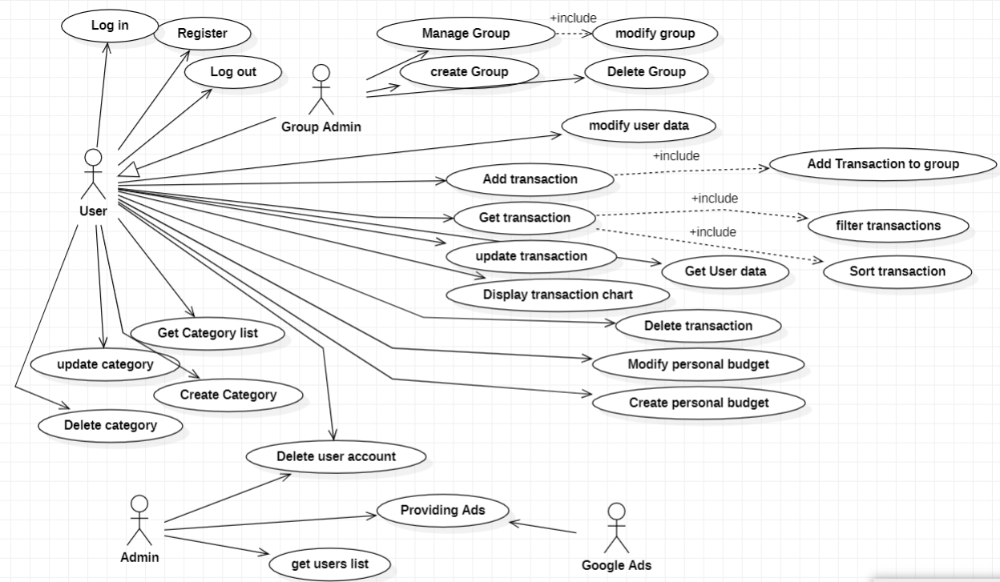
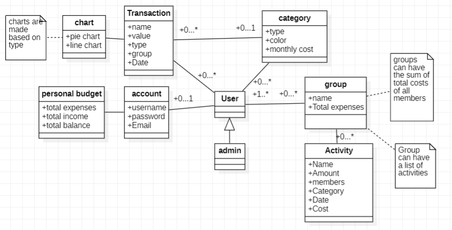
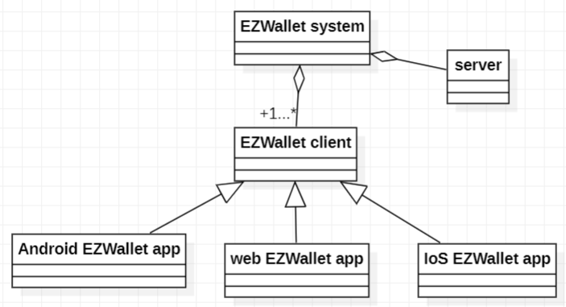
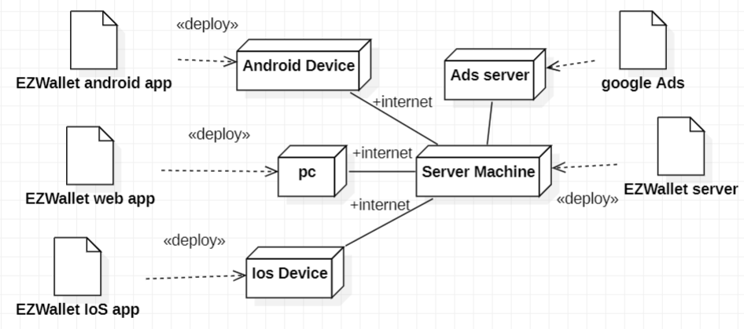

# Requirements Document - future EZWallet

Date: 28/04/2023

Version: V2 - description of EZWallet in FUTURE form (as proposed by the team)

| Version number | Change |
| ----------------- |:-----------:|
| Version 2| create groups and keep track of common expenses |
|			| display transactions statistics |
|			| create personal budget |
|			| delete user account |
|			| dev admin privileges added |
|			| manage categories | 

# Contents

- [Informal description](#informal-description)
- [Business model](#business-model)
- [Stakeholders](#stakeholders)
- [Context Diagram and interfaces](#context-diagram-and-interfaces)
	+ [Context Diagram](#context-diagram)
	+ [Interfaces](#interfaces) 
- [Stories and personas](#stories-and-personas)
- [Functional and non functional requirements](#functional-and-non-functional-requirements)
	+ [Functional Requirements](#functional-requirements)
	+ [Non functional requirements](#non-functional-requirements)
- [Use case diagram and use cases](#use-case-diagram-and-use-cases)
	+ [Use case diagram](#use-case-diagram)
	+ [Use cases](#use-cases)
    	+ [Relevant scenarios](#relevant-scenarios)
- [Glossary](#glossary)
- [System design](#system-design)
- [Deployment diagram](#deployment-diagram)

# Informal description
EZWallet (read EaSy Wallet) is a software application designed to help individuals and families keep track of their expenses. Users can enter and categorize their expenses, allowing them to quickly see where their money is going. EZWallet is a powerful tool for those looking to take control of their finances and make informed decisions about their spending.

# Business model
The service is provided for free with in-app ads.

# Stakeholders

| Stakeholder name  | Description | 
| ----------------- |:-----------:|
|  User   |  End user of the application  | 
|  StartUp   |  Developer and Provider of the application  | 
|  - Admin   | Part of StartUp, manages application | 
|  Google Ads  |  Ads provider of the application  | 
|  Google Play and App Store  |  Provide Android/iOS app store for the mobile application version | 
|  Competitors  |  Everydollar, Mint , Splitwise  | 

# Context Diagram and interfaces

## Context Diagram

## Interfaces

| Actor | Logical Interface | Physical Interface  |
| ------------- |:-------------:|:-----:|
|   User   | GUI| Smartphone/PC |
|   Admin   | GUI| PC |
|   Google ads   | https://developers.google.com/google-ads/api/docs/start | Internet link |

# Stories and personas
_Persona 1_: young professional, female, 24
- Story: started to work and wants to categories her transactions based on different types (categorized transaction for food,taxes,hobby).

_Persona 2_: high income, male, 45
- Story: never tracked expenses. Wants to track expenses and cut non necessary ones in order to save some money for a new car.

_Persona 3_: low income, male, student, 21
- Story: having a tight budget, wants to know exactly how he spends money.

_Persona 4_: high income, female, 28
- Story: travels with groups of people, needs to track overall expenses during travel and know how much money each member of the group spent.

# Functional and non functional requirements

## Functional Requirements

| ID        | Description  |
| ------------- |:-------------:| 
|FR1|Manage accounts|
|FR1.1|Get users|
|FR1.2|Login-logout|
|FR1.3|Delete account|
|FR1.4|Update account|
|FR2|Manage categories|
|FR2.1|Get categories|
|FR2.2|Create category|
|FR2.3|Update category|
|FR2.4|Delete category|
|FR3|Manage transactions|
|FR3.1|Get transactions|
|FR3.2|Create transaction|
|FR3.3|Delete transaction|
|FR3.4|Update transaction|
|FR3.5|Filter transaction|
|FR3.6|Sort transaction|
|FR4|Manage group|
|FR4.1|Create group|
|FR4.2|Delete group|
|FR4.3|Update group|
|FR5|Display transactions charts|
|FR6|Manage personal budget|
|FR6.1|Create personal budget|
|FR6.2|Update personal budget|
|FR7|Manage ads|
|FR7.1|Receive ads|
|FR7.2|Show ads|

## Table of access rights
||**User**|**Admin**|
| ------------- |:-------------:| ------------- |
|FR1.1|no|yes|
|FR1.2|yes|no|
|FR1.3|yes|yes|
|FR1.4|yes|no|
|FR2|yes|no|
|FR3|yes|no|
|FR4|yes|no|
|FR5|yes|no|
|FR6|yes|no|
|FR7|no|yes|

## Non Functional Requirements

|ID|Type|Description|Refers to|
| ------------- |:-------------:| :-----:| :-----:|
|NRF1|Usability|Usable by a user with at least 6 months of experience|FR1, FR2, FR3, FR4, FR5, FR6|
|NRF2|Efficiency|Functions should be done in less than 0.3 seconds|FR1, FR2, FR3, FR4, FR5, FR6|
|NRF3|Security|Non authorized user should not be able to use the application|FR1, FR2, FR3, FR4, FR5, FR6|
|NRF4|Availability|Downtime should be 1h/year|FR1, FR2, FR3, FR4, FR5, FR6, FR7|
|NRF5|Portability|Android and Ios version of app|FR1, FR2, FR3, FR4, FR5, FR6, FR7|

# Use case diagram and use cases

## Use case diagram

- [Login](#use-case-1-uc1-login)
- [Register](#use-case-2-uc2-register)
- [Logout](#use-case-3-uc3-logout)
- [Get user data](#use-case-4-uc4-getting-user-data)
- [Modify user data](#use-case-5-uc5-modify-user-data)
- [Admin deletes user account](#use-case-6-uc6-admin-deletes-users-account)
- [Delete user account](#use-case-7-uc7-user-deletes-his-account)
- [Create category](#use-case-8-uc8-create-a-category)
- [Get category list](#use-case-9-uc9-get-category-list)
- [Update category](#use-case-10-uc10-update-category)
- [Delete category](#use-case-11-uc11-delete-category)
- [Add a transaction](#use-case-12-uc12-add-a-transaction)
- [Get a transaction](#use-case-13-uc13-get-transaction)
- [Delete a transaction](#use-case-14-uc14-delete-a-transaction)
- [Update transaction](#use-case-15-uc15-update-transaction)
- [Display transaction charts](#use-case-16-uc16-display-transaction-charts)
- [Create a group](#use-case-17-uc17-group-creation)
- [Update a group](#use-case-18-uc18-group-management)
- [Delete a Group](#use-case-19-uc19-delete-group)
- [Create personal budget](#use-case-20-uc20-create-personal-budget)
- [Update personal budget](#use-case-21-uc21-update-personal-budget)
- [Providing ads](#use-case-22-uc22-providing-ads)

## Use cases

### Use case 1, UC1: Login
|Actors Involved|User, System|
| ------------- |:-------------:| 
|Precondition|User is not logged in|
|Post condition|User is logged in|
|Nominal Scenario|User enters by email and password (Scenario 1.1)|
|Variants|Scenario 1.4|
|Exceptions|Scenario 1.2, 1.3|

#### Scenario 1.1 

| Scenario 1.1 | |
| ------------- |:-------------:| 
|Precondition|User is not logged in|
|Post condition|User is logged in|
|Step#|Description|
|1|User requests for login|  
|2|System asks for email and password|
|3|User inserts email and password|
|4|System authorizes the user after checking email and password|

#### Scenario 1.2

| Scenario 1.2 | |
| ------------- |:-------------:| 
|Precondition|User is not logged in|
|Post condition|User is not logged in|
|Step#|Description|
|1|User requests for login|  
|2|System asks for email and password|
|3|User inserts email and password|
|4|System checks, aborts operation, password is wrong|

#### Scenario 1.3

| Scenario 1.3 | |
| ------------- |:-------------:| 
|Precondition|User is not logged in|
|Post condition|User is not logged in|
|Step#|Description|
|1|User requests for login|  
|2|System asks for email and password|
|3|User inserts email and password|
|4|System checks, aborts operation, entered email does not exist|

#### Scenario 1.4

| Scenario 1.4 | |
| ------------- |:-------------:| 
|Precondition|User is not logged in|
|Post condition|User is already logged in|
|Step#|Description|
|1|User requests for login|  
|2|System asks for email and password|
|3|User inserts email and password|
|4|System checks, aborts operation, entered email is already authorized|

### Use case 2, UC2: Register
|Actors Involved|User, System|
| ------------- |:-------------:| 
|Precondition|User has no account|
|Post condition|User has an account|
|Nominal Scenario|User makes a new account using email, username and password (Scenario 2.1)|
|Variants|-|
|Exceptions|Scenario 2.2|

#### Scenario 2.1

| Scenario 2.1 | |
| ------------- |:-------------:| 
|Precondition|User has no account|
|Post condition|User has an account|
|Step#|Description|
|1|User asks for register|  
|2|System asks for email|
|3|User enters email|
|4|System checks email|
|5|System asks for username|
|6|User enters a username|
|7|System asks for a password|
|8|User enters a password|
|9|System stores the new account|

#### Scenario 2.2

| Scenario 2.2 | |
| ------------- |:-------------:| 
|Precondition|User has no account|
|Post condition|User already has an account|
|Step#|Description|
|1|User asks for register|  
|2|System asks for email|
|3|User enters email|
|4|System checks email|
|5|System checks, aborts operation ,Email already exists in system|

### Use case 3, UC3: Logout
|Actors Involved|User, System|
| ------------- |:-------------:| 
|Precondition|User is logged in|
|Post condition|User is logged out|
|Nominal Scenario|User requests for log out (Scenario 3.1)|
|Variants|-|
|Exceptions|Scenario 3.2, 3.3|

#### Scenario 3.1

| Scenario 3.1 | |
| ------------- |:-------------:| 
|Precondition|User is logged in|
|Post condition|User is logged out|
|Step#|Description|
|1|User asks for logging out|  
|2|System checks tokens|
|3|User is logged out|

#### Scenario 3.2

| Scenario 3.2 | |
| ------------- |:-------------:| 
|Precondition|User is logged in|
|Post condition|User is logged out|
|Step#|Description|
|1|User asks for logging out|  
|2|System checks tokens|
|3|User has no token (is already logged out)|

#### Scenario 3.3

| Scenario 3.3 | |
| ------------- |:-------------:| 
|Precondition|User is logged in|
|Post condition|User is logged out|
|Step#|Description|
|1|User asks for logging out|  
|2|System checks tokens|
|3|User has invalid token|

### Use case 4, UC4: Getting user data
|Actors Involved|User, System, Admin|
| ------------- |:-------------:| 
|Precondition|User is logged in|
|Post condition|User gets data requested|
|Nominal Scenario|User requests for users list (Scenario 4.1)|
|Variants|Scenario 4.2|
|Exceptions|Scenario 4.3|

#### Scenario 4.1

| Scenario 4.1 | |
| ------------- |:-------------:| 
|Precondition|User is logged in|
|Post condition|User gets informations on his account|
|Step#|Description|
|1|User open tab with his informations|  
|2|System provide information|

#### Scenario 4.2

| Scenario 4.2 | |
| ------------- |:-------------:| 
|Precondition|User is logged in, other users have an account, user has admin privileges|
|Post condition|User (Admin) gets users list|
|Step#|Description|
|1|User asks for for users list|  
|2|System provides list of all users|

#### Scenario 4.3

| Scenario 4.3 | |
| ------------- |:-------------:| 
|Precondition|User is logged in, other users have an account|
|Post condition|System aborts operation|
|Step#|Description|
|1|User asks for for users list|  
|2|System checks if user has admin privileges|
|3|System aborts operation, user has no admin privileges|

### Use case 5, UC5: Modify user data
|Actors Involved|User, System|
| ------------- |:-------------:| 
|Precondition|User is logged in|
|Post condition|User data are modified|
|Nominal Scenario|User modifies his data (Scenario 5.1)|
|Variants|Scenario 5.2|
|Exceptions|Scenario 5.3|

#### Scenario 5.1

| Scenario 5.1 | |
| ------------- |:-------------:| 
|Precondition|User is logged in|
|Post condition|User username is modified|
|Step#|Description|
|1|User asks for his information|  
|2|User request to modify his username|
|3|System asks for new username|
|4|User inserts new username|
|5|System checks if username is already taken|
|6|Username is not taken, system saves changes|

#### Scenario 5.2

| Scenario 5.2 | |
| ------------- |:-------------:| 
|Precondition|User is logged in|
|Post condition|User password is modified|
|Step#|Description|
|1|User asks for his information|  
|2|User request to modify his password|
|3|System asks for new password|
|4|User inserts new password|
|3|System saves changes|

#### Scenario 5.3

| Scenario 5.3 | |
| ------------- |:-------------:| 
|Precondition|User is logged in|
|Post condition|User username is not modified|
|Step#|Description|
|1|User asks for his information|  
|2|User request to modify his username|
|3|System asks for new username|
|4|User inserts new username|
|5|System checks if username is already taken|
|6|Username is taken, system aborts operation|

### Use case 6, UC6: Admin deletes user/s account
|Actors Involved|Admin, System|
| ------------- |:-------------:| 
|Precondition|User is logged in, other users have an account, user has admin privileges|
|Post condition|User account is deleted|
|Nominal Scenario|Admin deletes user account (Scenario 6.1)|
|Variants|-|
|Exceptions|6.2|

#### Scenario 6.1

| Scenario 6.1 | |
| ------------- |:-------------:| 
|Precondition|User is logged in, other users have an account, user has admin privileges|
|Post condition|Admin deletes user account|
|Step#|Description|
|1|Admin selects user account/s to eliminate|  
|2|System checks if user/s exists|
|3|System deletes transactions and categories associated with user/s|

#### Scenario 6.2

| Scenario 6.2 | |
| ------------- |:-------------:| 
|Precondition|User is logged in, other users have an account, user has admin privileges|
|Post condition|Admin deletes user account|
|Step#|Description|
|1|Admin selects user account/s to eliminate|  
|2|System checks if user/s exists|
|3|User/s does not exist, system aborts|

### Use case 7, UC7: User deletes his account
|Actors Involved|User, System|
| ------------- |:-------------:| 
|Precondition|User has an account|
|Post condition|User account is deleted|
|Nominal Scenario|User deletes his user account (Scenario 7.1)|
|Variants|-|
|Exceptions|-|

#### Scenario 7.1

| Scenario 7.1 | |
| ------------- |:-------------:| 
|Precondition|User has an account|
|Post condition|User account is deleted|
|Step#|Description|
|1|User asks system to delete his account|  
|2|System deletes transactions and categories associated with user|

### Use case 8, UC8: Create a category
|Actors Involved|User, System|
| ------------- |:-------------:| 
|Precondition|User is logged in|
|Post condition|Category x is added to his categories|
|Nominal Scenario|User makes a new category (Scenario 8.1)|
|Variants|-|
|Exceptions|Scenario 8.2|

#### Scenario 8.1

| Scenario 8.1 | |
| ------------- |:-------------:| 
|Precondition|User is logged in|
|Post condition|Category x is added to his categories|
|Step#|Description|
|1|User asks for a new category|  
|2|System asks for category type and color|
|3|User enters a category type and color|
|4|System checks if category type is not already present|
|5|System creates the category|

#### Scenario 8.2

| Scenario 8.2 | |
| ------------- |:-------------:| 
|Precondition|User is logged in|
|Post condition|Category x is not added to his categories|
|Step#|Description|
|1|User asks for a new category|  
|2|System asks for category type and color|
|3|User enters a category type and color|
|4|System checks if category type is not already present|
|5|Category type is already present, system aborts|

### Use case 9, UC9: Get category list
|Actors Involved|User, System|
| ------------- |:-------------:| 
|Precondition|User is logged in, category list is saved in system|
|Post condition|User get his own category list|
|Nominal Scenario|User get category list (Scenario 9.1)|
|Variants|-|
|Exceptions|-|

#### Scenario 9.1

| Scenario 9.1 | |
| ------------- |:-------------:| 
|Precondition|User is logged in, category list is saved in the system|
|Post condition|User is allowed to get his own category list|
|Step#|Description|
|1|User asks for a list of all categories|  
|2|User gets his own category list|

### Use case 10, UC10: Update category
|Actors Involved|User, System|
| ------------- |:-------------:| 
|Precondition|User is logged in, he created category X on day D|
|Post condition|Category X is updated|
|Nominal Scenario|User updates category x, system saves changes (Scenario 10.1)|
|Variants|-|
|Exceptions|Scenario 10.2|

#### Scenario 10.1

| Scenario 10.1 | |
| ------------- |:-------------:| 
|Precondition|User is logged in, he created category X on day D|
|Post condition|User updates category x, system saves changes|
|Step#|Description|
|1|User open categories tab and select one|
|2|User update category data (color, type)|
|3|System check if category type is not already used|
|4|System saves changes|

#### Scenario 10.2

| Scenario 10.2 | |
| ------------- |:-------------:| 
|Precondition|User is logged in, he created category X on day D|
|Post condition|User updates category x, system abort operation|
|Step#|Description|
|1|User open categories tab and select one|
|2|User modify category data (color, type)|
|3|System check if category type is not already used|
|4|System abort operation, type already used|

### Use case 11, UC11: Delete category
|Actors Involved|User, System|
| ------------- |:-------------:| 
|Precondition|User is logged in, he created category X on day D|
|Post condition|Category X is deleted|
|Nominal Scenario|User deletes category x, system saves changes (Scenario 11.1)|
|Variants|-|
|Exceptions|Scenario 11.2|

#### Scenario 11.1

| Scenario 11.1 | |
| ------------- |:-------------:| 
|Precondition|User is logged in, he created category X on day D|
|Post condition|User deletes category x, system saves changes|
|Step#|Description|
|1|User open categories tab and select one|
|2|User delete category|
|3|System checks if category has associated transactions|
|4|Category has no associated transactions, system deletes category|

#### Scenario 11.2

| Scenario 11.2 | |
| ------------- |:-------------:| 
|Precondition|User is logged in, he created category X on day D|
|Post condition|User delete category x, system abort operation|
|Step#|Description|
|1|User open categories tab and select one|
|2|User deletes category|
|3|System check if category has associated transactions|
|4|System abort operation, category has associated transactions|

### Use case 12, UC12: Add a transaction
|Actors Involved|User, System|
| ------------- |:-------------:| 
|Precondition|User is logged in|
|Post condition|The transaction is added to transactions|
|Nominal Scenario|User makes a new transaction with name, value and type of category (Scenario 12.1)|
|Variants| 12.2 |
|Exceptions|-|

#### Scenario 12.1

| Scenario 12.1 | |
| ------------- |:-------------:| 
|Precondition|User is logged in|
|Post condition|The transaction is added to transactions|
|Step#|Description|
|1|User asks to insert a new transaction|  
|2|System asks for name, value and type of category|
|3|User enters name, value and type of category|
|4|System adds transaction|

#### Scenario 12.2

| Scenario 12.2 | |
| ------------- |:-------------:| 
|Precondition|User is logged in, is member of a group|
|Post condition|The transaction is added to the group|
|Step#|Description|
|1|User open group tab and select a group|  
|2|User asks to insert a new transaction in the group|  
|3|System asks for name, value and type of category|
|4|User enters name, value and type of category|
|5|System asks for participants to new transaction|
|6|User select participants of the group that partecipate in the new transaction|
|7|System adds transaction|

### Use case 13, UC13: Get transaction
|Actors Involved|User, System|
| ------------- |:-------------:| 
|Precondition|User is logged in, transactions are saved in the system|
|Post condition|User get transactions|
|Nominal Scenario|User retrieves his transaction (Scenario 13.1)|
|Variants|Scenario 13.2, 13.3, 13.4|
|Exceptions|Scenario 13.5|

#### Scenario 13.1

| Scenario 13.1 | |
| ------------- |:-------------:| 
|Precondition|User is logged in, transactions are saved in the system|
|Post condition|User get his transaction|
|Step#|Description|
|1|User asks for getting his transactions|  
|3|System retrieves user transactions|

#### Scenario 13.2

| Scenario 13.2 | |
| ------------- |:-------------:| 
|Precondition|User is logged in, transactions are saved in the system|
|Post condition|User get filtered transactions|
|Step#|Description|
|1|User asks for getting filtered transactions|  
|2|User selects filter criteria (time, category, group)|
|3|System checks if filtered transactions are present|
|4|System outputs list of filtered transactions|

#### Scenario 13.3

| Scenario 13.3 | |
| ------------- |:-------------:| 
|Precondition|User is logged in, he's member of a group|
|Post condition|User get all transaction of the group|
|Step#|Description|
|1|User open group tab and select a group|  
|2|User asks for getting all transactions associated to that group|  
|3|System retrieves all the transactions of that group|

#### Scenario 13.4

| Scenario 13.4 | |
| ------------- |:-------------:| 
|Precondition|User is logged in, transactions are saved in the system|
|Post condition|User gets sorted transactions|
|Step#|Description|
|1|User asks for getting sorted transactions|  
|2|User selects sort criteria (time, category, group)|
|3|System outputs list of sort transactions|

#### Scenario 13.5

| Scenario 13.5 | |
| ------------- |:-------------:| 
|Precondition|User is logged in, transactions are saved in the system|
|Post condition|User does not get transaction list|
|Step#|Description|
|1|User asks for getting transaction list|  
|2|System checks if there is at least one transactions|
|3|No transaction present, system aborts|

### Use case 14, UC14: Delete a transaction
|Actors Involved|User, System|
| ------------- |:-------------:| 
|Precondition|User is logged in, he added transaction X on day D|
|Post condition|The transaction X is deleted from transaction list|
|Nominal Scenario|Transaction X is deleted from system (Scenario 14.1)|
|Variants|-|
|Exceptions|-|

#### Scenario 14.1

| Scenario 14.1 | |
| ------------- |:-------------:| 
|Precondition|User has account, is logged in, he added transaction X on day D|
|Post condition|The transaction X is deleted from transaction list|
|Step#|Description|
|1|User asks for deletion of a transaction|  
|2|System deletes the transaction|

### Use case 15, UC15: Update transaction
|Actors Involved|User, System|
| ------------- |:-------------:| 
|Precondition|User is logged in, he added transaction X on day D|
|Post condition|The transaction X is updated|
|Nominal Scenario|Transaction X is updated (Scenario 15.1)|
|Variants|-|
|Exceptions|-|

#### Scenario 15.1

| Scenario 15.1 | |
| ------------- |:-------------:| 
|Precondition|User is logged in, he added transaction X on day D|
|Post condition|The transaction X is updated|
|Step#|Description|
|1|User request to update a transaction|  
|2|System asks for new name, amount and type of the transaction|
|3|System updates corresponding transaction|

### Use case 16, UC16: Display transaction charts
|Actors Involved|User, System|
| ------------- |:-------------:| 
|Precondition|User is logged in, transactions are saved in the system|
|Post condition|User sees transactions charts|
|Nominal Scenario|User asks for transactions charts (Scenario 16.1)|
|Variants|-|
|Exceptions|Scenario 16.2|

#### Scenario 16.1

| Scenario 16.1 | |
| ------------- |:-------------:| 
|Precondition|User is logged in, transactions are saved in the system|
|Post condition|User sees transactions charts|
|Step#|Description|
|1|Users asks for transactions charts|
|2|System checks if there is at least one transactions|
|3|At least one transaction is present, system computes transactions charts (pie, time-series)|
|4|System displays transactions charts|

#### Scenario 16.2

| Scenario 16.2 | |
| ------------- |:-------------:| 
|Precondition|User is logged in, transactions are saved in the system|
|Post condition|User doesn't sees transactions charts|
|Step#|Description|
|1|Users asks for transactions charts|
|2|System checks if there is at least one transactions|
|3|System abort operation, there are not transactions|

### Use case 17, UC17: Group creation
| Actors Involved        | User, System |
| ------------- |:-------------:| 
|  Precondition     | User is logged in|
|  Post condition     | New group is created |
|  Nominal Scenario     | User create a new group (Scenario 17.1) |
|  Variants     | - |
|  Exceptions     | - |

##### Scenario 17.1 

| Scenario 17.1 | |
| ------------- |:-------------:| 
|  Precondition     | User is logged in|
|  Post condition     | New group is created |
| Step#        | Description  |
|  1     | User opens tab for group and select group creation |  
|  2     | User defines group name, image and participants to add to the group |
|  3     | System create new group |

### Use case 18, UC18: Group management
| Actors Involved        | User, System |
| ------------- |:-------------:| 
|  Precondition     | User is logged in, he has created a group at day D |
|  Post condition     | Group information are modified |
|  Nominal Scenario     | User makes changes in group (Scenario 18.1) |
|  Variants     | Scenario 18.2, 18.3 |
|  Exceptions     | Scenario 18.4 |

##### Scenario 18.1 

| Scenario 18.1 | |
| ------------- |:-------------:| 
|  Precondition     | User is logged in, he has created a group at day D |
|  Post condition     | Group name is modified |
| Step#        | Description  |
|  1     | User opens tab for group and select group |  
|  2     | User select the group and open tab for group management |
|  3     | System checks if user is group admin |
|  4     | User changes the name of the group |
|  5     | System save change |

##### Scenario 18.2

| Scenario 18.2 | |
| ------------- |:-------------:| 
|  Precondition     | User is logged in, he has created a group at day D |
|  Post condition     | Group participant is added |
| Step#        | Description  |
|  1     | User opens tab for group and select group |  
|  2     | User select the group and open tab for group management |
|  3     | System checks if user is group admin |
|  4     | User sends invitation to new participant |
|  5     | System save change |

##### Scenario 18.3

| Scenario 18.3 | |
| ------------- |:-------------:| 
|  Precondition     | User is logged in, he has created a group at day D |
|  Post condition     | Group participant is removed |
| Step#        | Description  |
|  1     | User opens tab for group and select group | 
|  2     | User select the group and open tab for group management |
|  3     | System checks if user is group admin |
|  4     | User select participant that he wants to remove |
|  5     | System save change |

##### Scenario 18.4

| Scenario 18.4 | |
| ------------- |:-------------:| 
|  Precondition     | User is logged in, he has created a group at day D |
|  Post condition     | - |
| Step#        | Description  |
|  1     | User opens tab for group and select group |  
|  2     | User select the group and open tab for group management |
|  3     | System checks if user is group admin |
|  4     | User is not admin, system abort operation |

### Use case 19, UC19: Delete Group
| Actors Involved        | User, System |
| ------------- |:-------------:| 
|  Precondition     | User is logged in, he has created a group at day D |
|  Post condition     | Group is deleted |
|  Nominal Scenario     | User delete the group (Scenario 19.1) |
|  Variants     | - |
|  Exceptions     | Scenario 19.2 |

##### Scenario 19.1 

| Scenario 19.1 | |
| ------------- |:-------------:| 
|  Precondition     | User is logged in, he has created a group at day D |
|  Post condition     | Group is deleted |
| Step#        | Description  |
|  1     | User opens tab for group and selects group |  
|  2     | User selects the group and open tab for group management |
|  3     | System checks if user is group admin |
|  4     | User deletes the group |
|  5     | System saves change |

##### Scenario 19.2

| Scenario 19.2 | |
| ------------- |:-------------:| 
|  Precondition     | User is logged in, he has created a group at day D |
|  Post condition     | - |
| Step#        | Description  |
|  1     | User opens tab for group and select group |  
|  2     | User select the group and open tab for group management |
|  3     | System checks if user is group admin |
|  4     | User is not admin, system abort operation |

### Use case 20, UC20: Create personal budget
|Actors Involved|User, System|
| ------------- |:-------------:| 
|Precondition|User is logged in|
|Post condition|User personal budget is created|
|Nominal Scenario|User creates personal budget (Scenario 20.1)|
|Variants|-|
|Exceptions|-|

#### Scenario 20.1

| Scenario 20.1 | |
| ------------- |:-------------:| 
|Precondition|User is logged in|
|Post condition|User creates personal budget|
|Step#|Description|
|1|User goes on budget page|  
|2|User inputs budget amount and budget timeframe|
|3|System creates personal budget for user|

### Use case 21, UC21: Update personal budget
|Actors Involved|User, System|
| ------------- |:-------------:| 
|Precondition|User is logged in, user has personal budget|
|Post condition|User personal budget is modified|
|Nominal Scenario|User modifies personal budget (Scenario 21.1)|
|Variants|-|
|Exceptions|-|

#### Scenario 21.1

| Scenario 21.1 | |
| ------------- |:-------------:| 
|Precondition|User is logged in, user has personal budget|
|Post condition|User personal budget is modified|
|Step#|Description|
|1|User goes on budget page|  
|2|User inputs modified budget amount and budget timeframe|
|3|System modifies personal budget for user|

### Use case 22, UC22: Providing ads
|Actors Involved|Google ads, System|
| ------------- |:-------------:| 
|Precondition|Google ads API is reachable|
|Post condition|Ads are provided in application|
|Nominal Scenario|System requests ads (Scenario 22.1)|
|Variants|-|
|Exceptions|-|

#### Scenario 22.1

| Scenario 22.1 | |
| ------------- |:-------------:| 
|Precondition|Google ads API is reachable|
|Post condition|Ads are provided in application|
|Step#|Description|
|1|System requests ads|
|2|Google ads responds to request|
|3|Ads are provided|

# Glossary

# System Design

# Deployment Diagram 

