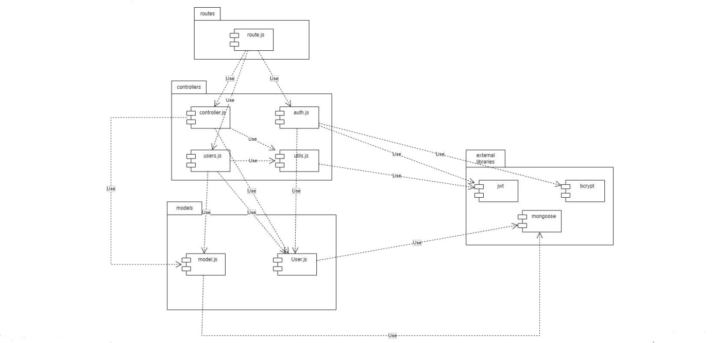
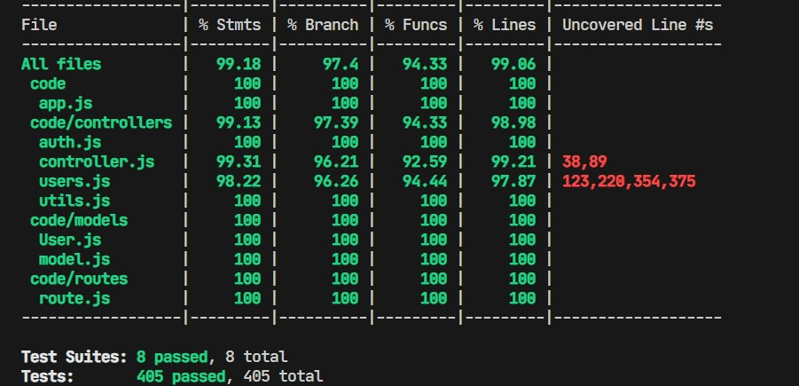

# Test Report

The goal of this document is to explain how the application was tested, detailing how the test cases were defined and what they cover

# Contents

- [Dependency graph](#dependency-graph)

- [Integration approach](#integration-approach)

- [Tests](#tests)

- [Coverage](#Coverage)

# Dependency graph 

     
# Integration approach

    Integration sequence:
    Generally, the approach is Top down. And the integration sequence is:
    step1: tests for utils.js 
    step2: Unit tests for functional requirements Manage Users + utils.js
    step3: Unit tests for Manage Users+ Manage Groups + utils.js
    step4: Unit tests for Manage categories + Manage Users + Manage Group + utils.js
    step5: Unit tests for Manage categories + Manage Users + Manage Groups + Manage transactions + utils.js
    step6: integration tests of all functions by route.js

# Tests

| Test case name | Object(s) tested | Test level | Technique used |
|--|--|--|--|
|register|register|||
|return success message when a new user is registered|-|unit|statement coverage|
|return error message when username is missing|-|unit|statement coverage|
|return error message when email is missing|-|unit|statement coverage|
|return error message when password is missing|-|unit|statement coverage|
|return error message when required fields have no valid data|-|unit|statement coverage|
|return error message when email is invalid|-|unit|statement coverage|
|return error message when user is already registered with the same email|-|unit|statement coverage|
|return error message when user is already registered with the same username|-|unit|statement coverage|
|return error status and error message when an error occurs during registration|-|unit|statement coverage|
|register a new user and return success message|-|integration|statement coverage|
|return an error if username is missing|-|integration|statement coverage|
|return an error if email is missing|-|integration|statement coverage|
|return an error if password is missing|-|integration|statement coverage|
|return an error if required fields are missing|-|integration|statement coverage|
|return an error message if required fields are missing|-|integration|statement coverage|
|return an error message if email is invalid|-|integration|statement coverage|
|return an error message if email is already registered|-|integration|statement coverage|
|return an error message if username is already taken|-|integration|statement coverage|
|register Admin|register Admin|||
|return success message when a new admin is registered|-|unit|statement coverage|
|return error message when username is missing|-|unit|statement coverage|
|return error message when email is missing|-|unit|statement coverage|
|return error message when password is missing|-|unit|statement coverage|
|return error message when required fields have no valid data|-|unit|statement coverage|
|return error message when email is invalid|-|unit|statement coverage|
|return error message when admin is already registered with the same email|-|unit|statement coverage|
|return error message when admin is already registered with the same username|-|unit|statement coverage|
|return error status and error message when an error occurs during admin registration|-|unit|statement coverage|
|register a new admin and return success message|-|integration|statement coverage|
|return an error if username is missing|-|integration|statement coverage|
|return an error if email is missing|-|integration|statement coverage|
|return an error if password is missing|-|integration|statement coverage|
|return an error if required fields are missing|-|integration|statement coverage|
|return an error message if email is invalid|-|integration|statement coverage|
|return an error message if email is already registered|-|integration|statement coverage|
|return an error message if username is already taken|-|integration|statement coverage|
|Login|Login|||
|return access token and refresh token when a user logs in successfully|-|unit|statement coverage|
|return error message when email is missing|-|unit|statement coverage|
|return error message when password is missing|-|unit|statement coverage|
|return error message when required fields have no valid data|-|unit|statement coverage|
|return error message when email is invalid|-|unit|statement coverage|
|return error message when user does not exist|-|unit|statement coverage|
|return error message when password is incorrect|-|unit|statement coverage|
|return error status and error message when an error occurs during login|-|unit|statement coverage|
|return access and refresh tokens upon successful login|-|integration|statement coverage|
|return an error if email is missing|-|integration|statement coverage|
|return an error if password is missing|-|integration|statement coverage|
|return an error if required fields are missing|-|integration|statement coverage|
|return an error message if email is invalid|-|integration|statement coverage|
|return an error message if user does not exist|-|integration|statement coverage|
|Logout|Logout|||
|log out the user and return success message|-|unit|statement coverage|
|return error when refresh token is not found|-|unit|statement coverage|
|return error when user is not found|-|unit|statement coverage|
|return error when an error occurs during logout|-|unit|statement coverage|
|log out a user and return success message|-|integration|statement coverage|
|return an error if user is not found|-|integration|statement coverage|
|return an error if refresh token is not found|-|integration|statement coverage|
|getUsers|getUsers|||
|return the list of users with a 200 status code|-|unit|statement coverage|
|return a 401 error if authentication fails|-|unit|statement coverage|
|return a 500 error if an error occurs|-|unit|statement coverage|
|retrieve list of all users|-|integration|statement coverage|
|return an empty list if there are no users|-|integration|statement coverage|
|return 401 error if called by an authenticated user who is not an admin (authType = Admin)|-|integration|statement coverage|
|getUser|getUser|||
|return user data with a 200 status code|-|unit|statement coverage|
|return a 400 error if username is missing|-|unit|statement coverage|
|return a 400 error if username is an empty string|-|unit|statement coverage|
|return a 401 error if both user and admin authentication fail|-|unit|statement coverage|
|return a 400 error if user is not found|-|unit|statement coverage|
|return a 500 error if an error occurs|-|unit|statement coverage|
|return an error if the user is not found|-|integration|statement coverage|
|return an error if the user is not authorized an USer or Admin|-|integration|statement coverage|
|return an error if the user passed as parameter is empty|-|integration|statement coverage|
|return user data|-|integration|statement coverage|
|deleteUser|deleteUser|||
|delete the user and return the expected response|-|unit|statement coverage|
|return a 400 error if the request body is missing the email field|-|unit|statement coverage|
|return a 400 error if the email field is empty|-|unit|statement coverage|
|return a 400 error if the email field is missing|-|unit|statement coverage|
|return a 400 error if the email format is invalid|-|unit|statement coverage|
|return a 400 error if the user does not exist|-|unit|statement coverage|
|return a 401 error if the user making the request is not an admin|-|unit|statement coverage|
|return a 400 error if attempting to delete an admin user|-|unit|statement coverage|
|return a 500 error if an error occurs during deletion|-|unit|statement coverage|
|delete the group if no members remain|-|unit|statement coverage|
|return an error if email is not provided|-|integration|statement coverage|
|return an error if email format is invalid|-|integration|statement coverage|
|return an error if user does not exist|-|integration|statement coverage|
|return an error if the authenticated user is not an admin|-|integration|statement coverage|
|return an error if trying to delete an admin user|-|integration|statement coverage|
|delete the user's data and remove user from groups|-|integration|statement coverage|
|delete the group if no members remain|-|integration|statement coverage|
| createCategory | createCategory |  |  |
| should return 401 if user is not admin | - | unit | statement coverage |
| should return 400 if type or color is missing | - | unit | statement coverage |
| should return 400 if type or color is empty | - | unit | statement coverage |
| should return 400 if category with the same type already exists | - | unit | statement coverage |
| should save the new category and return the data | - | unit | statement coverage |
| should return 500 if an exception occurs | - | unit | statement coverage |
| should return 401 if user is not admin | - | integration | statement coverage |
| should return 400 if parameters are missing | - | integration | statement coverage |
| should return 400 if parameters are empty | - | integration | statement coverage |
| should return 400 if category with thw same type already exist | - | integration | statement coverage |
| should save the new category and return the data | - | integration | statement coverage |
| updateCategory | updateCategory |  |  |
| should return 401 if user is not admin | - | unit | statement coverage |
| should return 400 if category to be updated is not in the system | - | unit | statement coverage |
| should return 400 if type or color is missing | - | unit | statement coverage |
| should return 400 if type or color is empty | - | unit | statement coverage |
| should return 400 if category already exists | - | unit | statement coverage |
| should update specified category and return a confirmation message and count of updated transaction | - | unit | statement coverage |
| should return 500 if an exception occurs | - | unit | statement coverage |
| should return 401 if user is not admin | - | integration | statement coverage |
| should return 400 if category to be updated is not in the system | - | integration | statement coverage |
| should return 400 if type or color is missing | - | integration | statement coverage |
| should return 400 if type or color is empty | - | integration | statement coverage |
| should return 400 if category with specified type already exist | - | integration | statement coverage |
| should update specified category and return a confirmation message and count of updated transaction | - | integration | statement coverage |
| deleteCategory | deleteCategory |  |  |
| should return 401 if user is not admin | - | unit | statement coverage |
| should return 400 if types is missing | - | unit | statement coverage |
| should return 400 if types is empty | - | unit | statement coverage |
| should return 400 if there is only one category saved | - | unit | statement coverage |
| should return 400 if one type in the array is empty | - | unit | statement coverage |
| should return 400 if one category not exists | - | unit | statement coverage |
| should delete specified categories and return a confirmation message and count of updated transaction | - | unit | statement coverage |
| should delete specified categories and return a confirmation message and count of updated transaction (special case: types includes all category saved) |  - | unit | statement coverage |
| should return 500 if an exception occurs | - | unit | statement coverage |
| should return 401 if user is not admin | - | integration | statement coverage |
| should return 400 if types is missing | - | integration | statement coverage |
| should return 400 if types is empty | - | integration | statement coverage |
| should return 400 if there is only one category saved | - | integration | statement coverage |
| should return 400 if one type in the array is empty | - | integration | statement coverage |
| should return 400 if one category not exists | - | integration | statement coverage |
| should delete specified categories and return a confirmation message and count of updated transaction | - | integration | statement coverage |
| getCategories | getCategories |  |  |
| should return 401 if user is not authenticated | - | unit | statement coverage |
| should return all categories saved | - | unit | statement coverage |
| should return 500 if an exception occurs | - | unit | statement coverage |
| should return 401 if user is not authenticated | - | integration | statement coverage |
| should return all categories saved | - | integration | statement coverage |
| verifyAuth | verifyAuth |  |  |
| should return unauthorized if one token is missing | - | unit | statement coverage |
| should return unauthorized if one token is missing information | - | unit | statement coverage |
| should return unauthorized if one token is missing information | - | unit | statement coverage |
| should return unauthorized if one token are from different user | - | unit | statement coverage |
| should return simple authorization | - | unit | statement coverage |
| should return user authorization | - | unit | statement coverage |
| should return user authorization with expired date | - | unit | statement coverage |
| should return invalid user | - | unit | statement coverage |
| should return admin authorization | - | unit | statement coverage |
| should return admin authorization with expired date | - | unit | statement coverage |
| should return invalid admin | - | unit | statement coverage |
| should return group authorization | - | unit | statement coverage |
| should return group authorization with expired date | - | unit | statement coverage |
| should return user not in group | - | unit | statement coverage |
| should return user authorization | - | unit | statement coverage |
| should raise error and suggest to perform login | - | unit | statement coverage |
| should raise error | - | unit | statement coverage |
| should raise error | - | unit | statement coverage |
| should return unauthorized if one token is missing information | - | integration | statement coverage |
| should return unauthorized if one token is missing information | - | integration | statement coverage |
| should return simple authorization | - | integration | statement coverage |
| should return user authorization | - | integration | statement coverage |
| should return invalid user | - | integration | statement coverage |
| should return admin authorization | - | integration | statement coverage |
| should return invalid admin | - | integration | statement coverage |
| should return group authorization | - | integration | statement coverage |
| should return user not in group | - | integration | statement coverage |
| should return simple authorization with token refresh | - | integration | statement coverage |
| should return user authorization with token refresh | - | integration | statement coverage |
| should return user not authorized (with token expired) | - | integration | statement coverage |
| should return admin authorization with token refresh | - | integration | statement coverage |
| should return admin not authorized (with token expired) | - | integration | statement coverage |
| should return group authorization with token refresh | - | integration | statement coverage |
| should return user not in group (with token expired) | - | integration | statement coverage |
| should raise error and suggest to perform login | - | integration | statement coverage |
| handleAmountFilterParams | handleAmountFilterParams |  |  |
| should accept no query params | - | unit | statement coverage |
| should accept single params | - | unit | statement coverage |
| should accept min, max query params | - | unit | statement coverage |
| should raise error if params isNan | - | unit | statement coverage |
| handleDateFilterParams | handleDateFilterParams |  |  |
| should raise error if there is date with from/up to | - | unit | statement coverage |
| should raise error if there is date, from, up to wrong format | - | unit | statement coverage |
| should accept no query params | - | unit | statement coverage |
| should manage different params combination | - | unit | statement coverage |
| createTransaction | createTransaction |  |  |
| should create a new transaction | - | unit | statement coverage |
| should return a 400 error if at least one of the parameters in the request body is an empty string | - | unit | statement coverage |
| should return a 400 error if the type of category passed in the request body does not represent a category in the database | - | unit | statement coverage |
| should return a 400 error if the amount passed in the request body cannot be parsed as a floating value | - | unit | statement coverage |
| Returns a 500 error if transaction creation fails | - | unit | statement coverage |
| should return 400 if parameters are missing | - | integration | statement coverage |
| should return a 400 error if the category type does not exist | - | integration | statement coverage |
| should create a new transaction and return the data | - | integration | statement coverage |
| Returns a 400 error if the username passed in the request body does not represent a user in the database | - | integration | statement coverage |
| Returns a 400 error if the username passed as a route parameter does not represent a user in the database | - | integration | statement coverage |
| Returns a 400 error if the username passed in the request body is not equal to the one passed as a route parameter | - | integration | statement coverage |Returns a 400 error if the amount passed in the request body cannot be parsed as a floating value (negative numbers are accepted)|-|integration|statement coverage|
|Returns a 401 error if called by an authenticated user who is not the same user as the one in the route parameter (authType = User)|-|integration|statement coverage|
| getAllTransactions | getAllTransactions |  |  |
| Should get the list of all Transactions | - | unit | statement coverage |
| return empty array if there are no transactions | - | unit | statement coverage | 
| should return a 401 error if called by an authenticated user who is not an admin (authType = Admin) | - | unit | statement coverage |
| should return a 500 error if an exception occurs | - | unit | statement coverage |
| should return all transactions saved | - | integration | statement coverage |
| Returns a 401 error if called by an authenticated user who is not an admin (authType = Admin) | - | integration | statement coverage |
| empty array must be returned if there are no transactions | - | integration | statement coverage |
| getTransactionsByUser | getTransactionsByUser |  |  |
| Should return transactions for a specified user | - | unit | statement coverage |
| error 400 is returned if the user does not exist | - | unit | statement coverage |
| empty array is returned if there are no transactions made by the user| - | unit | statement coverage |
| if there are query parameters and the function has been called by a Regular user then the returned transactions must be filtered according to the query parameters | - | unit | statement coverage |
| Returns a 401 error if called by an authenticated user who is not the same user as the one in the route (authType = User) if the route is `/api/users/:username/transactions` | - | unit | statement coverage |
| Returns a 401 error if called by an authenticated user who is not an admin (authType = Admin) if the route is `/api/transactions/users/:username` | - | unit | statement coverage |
| Should return a 500 error code on server error| - | unit | statement coverage |
| Should return error 400 if parameters are missing| - | unit | statement coverage |
| Should return error 400 if parameters are empty string|  - | unit | statement coverage |
| Should retrieve transactions made by a specified user | - | integration | statement coverage |
| error 400 is returned if the user does not exist | - | integration | statement coverage |
| Returns a 400 error if the username passed as a route parameter does not represent a user in the database | - | integration | statement coverage |
| Returns a 401 error if called by an authenticated user who is not an admin (authType = Admin) if the route is `/api/transactions/users/:username` | - | integration | statement coverage |
| Returns a 401 error if called by an authenticated user who is not an admin (authType = Admin) if the route is `/api/transactions/users/:username` | - | integration | statement coverage |
| getTransactionsByUserByCategory | getTransactionsByUserByCategory |  |  |
| Should Return all transactions made by a specific user filtered by a specific category | - | unit | statement coverage |
| Returns a 400 error if the username passed as a route parameter does not represent a user in the database | - | unit | statement coverage |
|Returns a 401 error if called by an authenticated user who is not the same user as the one in the route (authType = User) if the route is `/api/users/:username/transactions/category/:category` | - | unit | statement coverage |
| Returns a 400 error if the username passed as a route parameter does not represent a category in the database | - | unit | statement coverage |
| Returns a 401 error if called by an authenticated user who is not an admin (authType = Admin) if the route is `/api/transactions/users/:username/category/:category` | - | unit | statement coverage |
| should return an empty array if no transactions found | - | unit | statement coverage |
| should return error 400 with empty parameters | - | unit | statement coverage |
| should return error 400 with missing parameters | - | unit | statement coverage |
| 500 error code internal error| - | unit | statement coverage |
| should retrieve transactions by user by category specified in the route | - | integration | statement coverage |
| empty array is returned if there are no transactions made by the user with the specified category| - | integration | statement coverage |
| error 400 is returned if the user does not exist| - | integration | statement coverage |
| Returns a 400 error if the category passed as a route parameter does not represent a category in the database | - | integration | statement coverage |
| Returns a 401 error if called by an authenticated user who is not an admin (authType = Admin) if the route is `/api/transactions/users/:username/category/:category` | - | integration | statement coverage |
| Returns a 401 error if called by an authenticated user who is not the same user as the one in the route (authType = User) if the route is `/api/users/:username/transactions/category/:category     | - | integration | statement coverage |
|GetTransactionsByGroup| GetTransactionsByGroup |      |        |
| should return transactions grouped by category  | - | unit | statement coverage |
| should return an empty array if no transactions found | - | unit | statement coverage |
| should return a 400 error if the group does not exist   | - | unit | statement coverage |
| should return a 401 error if called by an authenticated user who is not part of the group (authType = Group) | - | unit | statement coverage |
| should return a 401 error if called by an authenticated user who is not an admin (authType = Admin) | - | unit | statement coverage |
| Missing parameters | - | unit | statement coverage |
| Empty string parameters | - | unit | statement coverage |
| 500 error for getTransactionsByGroup | - | unit | statement coverage |
| should retrieve transactions filtered by a Group | - | integration | statement coverage |
| empty array must be returned if there are no transactions made by the group | - | integration | statement coverage |
| error 400 is returned if the group does not exist  | - | integration | statement coverage |
| Returns a 401 error if called by an authenticated user who is not part of the group (authType = Group)   | - | integration | statement coverage |
|Returns a 401 error if called by an authenticated user who is not an admin (authType = Admin) if the route is `/api/transactions/groups/:name` | - | integration | statement coverage |
|GetTransactionsByGroupByCategory | GetTransactionsByGroupByCategory |    |      |
| should Return all transactions made by members of a specific group filtered by a specific category  | - | unit | statement coverage |
| Returns a 400 error if the group name passed as a route parameter does not represent a group in the database  | - | unit | statement coverage |
| Returns a 400 error if the category name passed as a route parameter does not represent a category in the database | - | unit | statement coverage |
| Returns a 400 error if there are missing parameters | - | unit | statement coverage |
| Returns a 400 error if there are empty parameters | - | unit | statement coverage |
| should return a 401 error if called by an authenticated user who is not part of the group (authType = Group) | - | unit | statement coverage |
| Returns a 401 error if called by an authenticated user who is not an admin (authType = Admin) if the route is `/api/transactions/groups/:name/category/:category` | - | unit | statement coverage |
| empty array must be returned if there are no transactions made by the group with the specified category  | - | unit | statement coverage |
| should retrieve transactions filtered by a Group and by category   | - | integration | statement coverage |
| empty array must be returned if there are no transactions made by the group with the specified category  | - | integration | statement coverage |
| error 400 is returned if the group does not exist  | - | integration | statement coverage |
| Returns a 400 error if the category passed as a route parameter does not represent a category in the database | - | integration | statement coverage |
| Returns a 401 error if called by an authenticated user who is not part of the group (authType = Group) if the route is `/api/groups/:name/transactions/category/:category` | - | integration | statement coverage |
| Returns a 401 error if called by an authenticated user who is not an admin (authType = Admin) if the route is `/api/transactions/groups/:name/category/:category` | - | integration | statement coverage |
|DeleteTransaction | DeleteTransaction | |     |
| Delete a transaction made by a specific user | - | unit | statement coverage |
| Returns a 400 error if the request body does not contain all the necessary attributes | - | unit | statement coverage |
| Returns a 400 error if the `_id` in the request body is an empty string | - | unit | statement coverage |
| Returns a 400 error if the username passed as a route parameter does not represent a user in the database | - | unit | statement coverage |
| Returns a 400 error if the transaction id passed as a route parameter does not represent a user in the database | - | unit | statement coverage |
|  Returns a 400 error if the `_id` in the request body represents a transaction made by a different user than the one in the route | - | unit | statement coverage |
| Returns a 401 error if called by an authenticated user who is not the same user as the one in the route (authType = User) | - | unit | statement coverage |
| Returns a 500 error if an error occurs during processing | - | unit | statement coverage |
| should delete specified transaction and return a confirmation message| - | integration | statement coverage |
| error 400 is returned if the user does not exist | - | integration | statement coverage |
| error 400 is returned if the transaction does not exist | - | integration | statement coverage |
| Returns a 400 error if the request body does not contain all the necessary attributes | - | integration | statement coverage |
| Returns a 400 error if the `_id` in the request body is an empty string | - | integration | statement coverage |
| Returns a 400 error if the `_id` in the request body represents a transaction made by a different user than the one in the route | - | integration | statement coverage |
| Returns a 401 error if called by an authenticated user who is not the same user as the one in the route (authType = User) | - | integration | statement coverage |
|DeleteTransactions |DeleteTransactions |      |
| Delete multiple transactions identified by their ids | - | unit | statement coverage |
| error 400 is returned if at least one of the `_ids` does not have a corresponding transaction. Transactions that have an id are not deleted in this case | - | unit | statement coverage |
| Returns a 400 error if the request body does not contain all the necessary attributes | - | unit | statement coverage |
| Returns a 400 error if at least one of the ids in the array is an empty string | - | unit | statement coverage |
| Returns a 400 error if at least one of the ids in the array does not represent a transaction in the database | - | unit | statement coverage |
| Returns a 401 error if called by an authenticated user who is not an admin (authType = Admin) | - | unit | statement coverage |
| Should return a 500 error if an error occurs during deletion| - | unit | statement coverage |
|should delete specified transactions and return a confirmation message| - | integration | statement coverage |
| Returns a 400 error if the request body does not contain all the necessary attributes| - | integration | statement coverage |
| Returns a 400 error if at least one of the ids in the array is an empty string| - | integration | statement coverage |
| Returns a 400 error if at least one of the ids in the array does not represent a transaction in the database| - | integration | statement coverage |
| Returns a 401 error if called by an authenticated user who is not an admin (authType = Admin)| - | integration | statement coverage |
| | | |
| createGroup | createGroup |  |  |
| should create a new group | - | unit | statement coverage |
| should return a 400 error if the request body does not contain all the necessary attributes| - | unit | statement coverage |
| should return a 400 error if the group name passed in the request body is an empty string | - | unit | statement coverage |
|should return a 400 error if the group name passed in the request body represents an already existing group in the database | - | unit | statement coverage |
| should return a 400 error if all the provided emails represent users that are already in a group or do not exist in the database | - | unit | statement coverage |
|should return a 400 error if the user who calls the API is already in a group | - | unit | statement coverage |
| should return a 400 error if a member email has not a valid format | - | unit | statement coverage |
| should return a 400 error if at least one of the member emails is an empty string | - | unit | statement coverage |
|should return a 401 error if the user is not authorized | - | unit | statement coverage |
| should return a 500 error if an exception occurs| - | unit | statement coverage |
| should create a new group | - | integration | statement coverage |
| should return 400 error if the request body does not contain all the necessary attributes | - | integration | statement coverage |
|should return 400 error if the request body does not contain all the necessary attributes | - | integration | statement coverage |
| should return 400 error if the group name passed in the request body is an empty string | - | integration | statement coverage |
| should return 400 error if the email array is empty | - | integration | statement coverage |
| should return 400 error if one of the email is an empty string | - | integration | statement coverage |
| should return 400 error if the group name passed in the request body represents an already existing group in the database | - | integration | statement coverage |
|should return 400 error if the calling user is already in a group | - | integration | statement coverage |
| should return 400 error if at least one of the member emails is not in a valid email format | - | integration | statement coverage |
| should return 400 error if all the provided emails represent users that are already in a group or do not exist in the database | - | integration | statement coverage |
| should return 401 error if called by a user who is not authenticated (authType = Simple) | - | integration | statement coverage |
| getGroups | getGroups |  |  |
| should return list of all groups | - | unit | statement coverage |
| should return an empty list | - | unit | statement coverage |
| should return 401 if user is not authorized| - | unit | statement coverage |
| should return a 500 error if an exception occurs | - | unit | statement coverage |
| should return list of all groups | - | integration | statement coverage |
| should return empty list if there are no groups | - | integration | statement coverage |
| should return a 401 error if called by an authenticated user who is not an admin (authType = Admin)| - | integration | statement coverage |
| getGroup | getGroup |  |  |
| should return requested group | - | unit | statement coverage |
| should return 400 if group does not exist | - | unit | statement coverage |
| should return 400 if group name is not provided | - | unit | statement coverage |
| should return 400 if group name is an empty string | - | unit | statement coverage |
| should return 401 if user is not authorized | - | unit | statement coverage |
| should return a 500 error if an exception occurs | - | unit | statement coverage |
| should return group with given name | - | integration | statement coverage |
| should return a 400 error if the group name passed as a route parameter does not represent a group in the database | - | integration | statement coverage |
| should return a 400 error if the group name passed as a route parameter is and empty string | - | integration | statement coverage |
| should return a 401 error if called by an authenticated user who is not an admin (authType = Admin) | - | integration | statement coverage |
| addToGroup | addToGroup |  |  |
| admin should add users to group | - | unit | statement coverage |
| member should add users to group | - | unit | statement coverage |
| should return a 400 error if the request body does not contain all the necessary attributes| - | unit | statement coverage |
| should return a 400 error if the request body does not contain all the necessary attributes | - | unit | statement coverage |
| should return a 400 error if the group name passed as a route parameter does not represent a group in the database | - | unit | statement coverage |
| should return a 400 error if all the provided emails represent users that are already in a group or do not exist in the database | - | unit | statement coverage |
| should return a 400 error if at least one of the member emails is not in a valid email format| - | unit | statement coverage |
| should return a 400 error if at least one of the member emails is an empty string | - | unit | statement coverage |
| should return a 401 error if called by an authenticated user who is not part of the group (authType = Group) if the route is `api/groups/:name/add` | - | unit | statement coverage |
| should return a 401 error if called by an authenticated user who is not an admin (authType = Admin) if the route is `api/groups/:name/insert` | - | unit | statement coverage |
| should return a 401 error if called by an authenticated user who is not an admin (authType = Admin) if the route is `api/groups/:name/insert` | - | unit | statement coverage |
| should return a 500 error if an exception occurs | - | unit | statement coverage |
| should return 200 and add user to group (member of group) | - | integration | statement coverage |
| should return 200 and add user to group (admin) | - | integration | statement coverage |
| should return 400 error if the request body does not contain all the necessary attributes | - | integration | statement coverage |
| should return 400 error if the emails array in the request body is empty | - | integration | statement coverage |
| should return 400 error if at least one email in the emails array in the request body is an empty string | - | integration | statement coverage |
| should return 400 error if at least one email in the emails array in the request body has an invalid format | - | integration | statement coverage |
| should return 400 error if the group name passed as a route parameter does not represent a group in the database| - | integration | statement coverage |
| should return 400 error if no group name is provided | - | integration | statement coverage |
| should return 400 error if all the provided emails represent users that are already in a group or do not exist in the database | - | integration | statement coverage |
| should return 401 error if called by an authenticated user who is not part of the group (authType = Group) | - | integration | statement coverage |
| should return 401 error if called by an authenticated user who is not part of the group (authType = Admin) | - | integration | statement coverage |
| removeFromGroup | removeFromGroup |  |  |
| should return a 200 status code if the users are successfully removed from the group | - | unit | statement coverage |
| should return a 200 status code if the users are successfully removed (by admin) from the group | - | unit | statement coverage |
| should return a 400 error if the request body does not contain all the necessary attributes | - | unit | statement coverage |
| should return a 400 error if the group name passed as a route parameter does not represent a group in the database| - | unit | statement coverage |
| should return a 400 error if all the provided emails represent users that do not belong to the group or do not exist in the database | - | unit | statement coverage |
| should return a 400 error if at least one of the emails is not in a valid email format | - | unit | statement coverage |
| should return a 400 error if at least one of the emails is an empty string | - | unit | statement coverage |
| should return a 400 error if the group contains only one member before deleting any user| - | unit | statement coverage |
| should return a 401 error if called by an authenticated user who is not part of the group (authType = Group) if the route is `api/groups/:name/remove` | - | unit | statement coverage |
| should return a 401 error if called by an authenticated user who is not an admin (authType = Admin) if the route is `api/groups/:name/pull` | - | unit | statement coverage |
| should return a 500 error if an exception occurs | - | unit | statement coverage |
| should return 200 and add user to group (member of group) | - | integration | statement coverage |
| should return 200 and remove user from group (admin) | - | integration | statement coverage |
|should return 400 error if the request body does not contain all the necessary attributes | - | integration | statement coverage |
| should return 400 error if the emails array in the request body is empty| - | integration | statement coverage |
| should return 400 error if at least one email in the emails array in the request body is an empty string | - | integration | statement coverage |
| should return 400 error if at least one email in the emails array in the request body has an invalid format | - | integration | statement coverage |
| should return 400 error if the group name passed as a route parameter does not represent a group in the database | - | integration | statement coverage |
| should return 400 error if no group name is provided| - | integration | statement coverage |
| should return 400 error if all the provided emails represent users that are already in a group or do not exist in the database | - | integration | statement coverage |
| should return 400 error if trying to remove last member in group | - | integration | statement coverage |
| should return 401 error if called by an authenticated user who is not part of the group (authType = Group) | - | integration | statement coverage |
| should return 401 error if called by an authenticated user who is not part of the group (authType = Admin) | - | integration | statement coverage |
| deleteGroup | deleteGroup |  |  |
| should return a 200 status code and a message confirming successful deletion if the group is deleted successfully | - | unit | statement coverage |
| should return a 400 error if the request body does not contain all the necessary attributes| - | unit | statement coverage |
| should return a 400 error if the name passed in the request body is an empty string | - | unit | statement coverage |
| should return a 400 error if the name passed in the request body does not represent a group in the database | - | unit | statement coverage |
| should return a 401 error if called by an authenticated user who is not an admin (authType = Admin)| - | unit | statement coverage |
| should return a 500 error if an exception occurs | - | unit | statement coverage |
|should return 200 and a message confirming deletion | - | integration | statement coverage |
| should return 400 error if the request body does not contain all the necessary attributes | - | integration | statement coverage |
| should return 400 error if the name passed in the request body is an empty string | - | integration | statement coverage |
| should return 400 error if the name passed in the request body does not represent a group in the database | - | integration | statement coverage |
| should return 400 error if the name passed in the request body does not represent a group in the database | - | integration | statement coverage |
| | | |

# Coverage

## Coverage of FR

| Functional Requirements covered |   Test(s) | 
| ------------------------------- | ----------- | 
| FR1-Manage users                   |             |  
| FR11-register                  |             |
||return success message when a new user is registered|
||return error message when username is missing|
||return error message when email is missing|
||return error message when password is missing|
||return error message when required fields have no valid data|
||return error message when email is invalid|
||return error message when user is already registered with the same email|
||return error message when user is already registered with the same username|
||return error status and error message when an error occurs during registration|
||register a new user and return success message|
||return an error if username is missing|
||return an error if email is missing|
||return an error if password is missing|
||return an error if required fields are missing|
||return an error message if required fields are missing|
||return an error message if email is invalid|
||return an error message if email is already registered|
||return an error message if username is already taken|
|FR12-login||
||return access token and refresh token when a user logs in successfully|
||return error message when email is missing|
||return error message when password is missing|
||return error message when required fields have no valid data|
||return error message when email is invalid|
||return error message when user does not exist|
||return error message when password is incorrect|
||return error status and error message when an error occurs during login|
||return access and refresh tokens upon successful login|
||return an error if email is missing|
||return an error if password is missing|
||return an error if required fields are missing|
||return an error message if email is invalid|
||return an error message if user does not exist|
|FR13-logout||
||log out the user and return success message|
||return error when refresh token is not found|
||return error when user is not found|
||return error when an error occurs during logout|
||log out a user and return success message|
||return an error if user is not found|
||return an error if refresh token is not found|
|FR14-registerAdmin||
||return success message when a new admin is registered|
||return error message when username is missing|
||return error message when email is missing|
||return error message when password is missing|
||return error message when required fields have no valid data|
||return error message when email is invalid|
||return error message when admin is already registered with the same email|
||return error message when admin is already registered with the same username|
||return error status and error message when an error occurs during admin registration|
||register a new admin and return success message|
||return an error if username is missing|
||return an error if email is missing|
||return an error if password is missing|
||return an error if required fields are missing|
||return an error message if email is invalid|
||return an error message if email is already registered|
||return an error message if username is already taken|
|FR15-getUsers||
||return the list of users with a 200 status code|
||return a 401 error if authentication fails|
||return a 500 error if an error occurs|
||retrieve list of all users|
||return an empty list if there are no users|
||return 401 error if called by an authenticated user who is not an admin (authType = Admin)|
|FR16-getUser||
||return user data with a 200 status code|
||return a 400 error if username is missing|
||return a 400 error if username is an empty string|
||return a 401 error if both user and admin authentication fail|
||return a 400 error if user is not found|
||return a 500 error if an error occurs|
||return an error if the user is not found|
||return an error if the user is not authorized an USer or Admin|
||return an error if the user passed as parameter is empty|
||return user data|
|FR17-deleteUser||
||delete the user and return the expected response|
||return a 400 error if the request body is missing the email field|
||return a 400 error if the email field is empty|
||return a 400 error if the email field is missing|
||return a 400 error if the email format is invalid|
||return a 400 error if the user does not exist|
||return a 401 error if the user making the request is not an admin|
||return a 400 error if attempting to delete an admin user|
||return a 500 error if an error occurs during deletion|
||delete the group if no members remain|
||return an error if email is not provided|
||return an error if email format is invalid|
||return an error if user does not exist|
||return an error if the authenticated user is not an admin|
||return an error if trying to delete an admin user|
||delete the user's data and remove user from groups|
||delete the group if no members remain|
| FR2-Manage groups                  |             |
| FR21-createGroup |  | 
| |should create a new group | 
| |should return a 400 error if the request body does not contain all the necessary attributes|
| |should return a 400 error if the group name passed in the request body is an empty string | 
| |should return a 400 error if the group name passed in the request body represents an already existing group in the database |
| |should return a 400 error if all the provided emails represent users that are already in a group or do not exist in the database | 
| |should return a 400 error if the user who calls the API is already in a group | 
| |should return a 400 error if a member email has not a valid format | 
| |should return a 400 error if at least one of the member emails is an empty string | 
| |should return a 401 error if the user is not authorized |
| |should return a 500 error if an exception occurs| 
| |should create a new group | 
| |should return 400 error if the request body does not contain all the necessary attributes | 
| |should return 400 error if the request body does not contain all the necessary attributes | 
| |should return 400 error if the group name passed in the request body is an empty string | 
| |should return 400 error if the email array is empty |
| |should return 400 error if one of the email is an empty string | 
| |should return 400 error if the group name passed in the request body represents an already existing group in the database | 
| |should return 400 error if the calling user is already in a group | 
| |should return 400 error if at least one of the member emails is not in a valid email format | 
| |should return 400 error if all the provided emails represent users that are already in a group or do not exist in the database | 
| |should return 401 error if called by a user who is not authenticated (authType = Simple) | 
| |getGroups |  |  
| |should return list of all groups | 
| |should return an empty list | 
| |should return 401 if user is not authorized| 
| |should return a 500 error if an exception occurs |
| |should return list of all groups | 
| |should return empty list if there are no groups | 
| |should return a 401 error if called by an authenticated user who is not an admin (authType = Admin)| 
| FR22-getGroups |  |
|| should return list of all groups |
|| should return an empty list |
|| should return 401 if user is not authorized|
|| should return a 500 error if an exception occurs |
|| should return list of all groups |
|| should return empty list if there are no groups |
|| should return a 401 error if called by an authenticated user who is not an admin (authType = Admin)| 
| FR23-getGroup |  | 
| |should return requested group | 
| |should return 400 if group does not exist | -
| |should return 400 if group name is not provided |
| |should return 400 if group name is an empty string | 
| |should return 401 if user is not authorized | 
| |should return a 500 error if an exception occurs | |
| |should return group with given name | 
| |should return a 400 error if the group name passed as a route parameter does not represent a group in the database | |
| |should return a 400 error if the group name passed as a route parameter is and empty string | 
| |should return a 401 error if called by an authenticated user who is not an admin (authType = Admin) | |
| FR24-addToGroup |  |  
| |admin should add users to group | 
| |member should add users to group | 
| |should return a 400 error if the request body does not contain all the necessary attributes| 
| |should return a 400 error if the request body does not contain all the necessary attributes | 
| |should return a 400 error if the group name passed as a route parameter does not represent a group in the database | 
| |should return a 400 error if all the provided emails represent users that are already in a group or do not exist in the database | 
| |should return a 400 error if at least one of the member emails is not in a valid email format| 
| |should return a 400 error if at least one of the member emails is an empty string | 
| |should return a 401 error if called by an authenticated user who is not part of the group (authType = Group) if the route is `api/groups/:name/add` |
| |should return a 401 error if called by an authenticated user who is not an admin (authType = Admin) if the route is `api/groups/:name/insert` | 
| |should return a 401 error if called by an authenticated user who is not an admin (authType = Admin) if the route is `api/groups/:name/insert` | 
| |should return a 500 error if an exception occurs | 
| |should return 200 and add user to group (member of group) | 
| |should return 200 and add user to group (admin) | 
| |should return 400 error if the request body does not contain all the necessary attributes | 
| |should return 400 error if the emails array in the request body is empty | 
| |should return 400 error if at least one email in the emails array in the request body is an empty string | 
| |should return 400 error if at least one email in the emails array in the request body has an invalid format | 
| |should return 400 error if the group name passed as a route parameter does not represent a group in the database| 
| |should return 400 error if no group name is provided | 
| |should return 400 error if all the provided emails represent users that are already in a group or do not exist in the database | 
| |should return 401 error if called by an authenticated user who is not part of the group (authType = Group) | 
| |should return 401 error if called by an authenticated user who is not part of the group (authType = Admin) | 
| FR26-removeFromGroup |  | 
| |should return a 200 status code if the users are successfully removed from the group | 
| |should return a 200 status code if the users are successfully removed (by admin) from the group | 
| |should return a 400 error if the request body does not contain all the necessary attributes | 
| |should return a 400 error if the group name passed as a route parameter does not represent a group in the database| 
| |should return a 400 error if all the provided emails represent users that do not belong to the group or do not exist in the database | 
| |should return a 400 error if at least one of the emails is not in a valid email format | 
| |should return a 400 error if at least one of the emails is an empty string | 
| |should return a 400 error if the group contains only one member before deleting any user| 
| |should return a 401 error if called by an authenticated user who is not part of the group (authType = Group) if the route is `api/groups/:name/remove` | 
| |should return a 401 error if called by an authenticated user who is not an admin (authType = Admin) if the route is `api/groups/:name/pull` | 
| |should return a 500 error if an exception occurs | 
| |should return 200 and add user to group (member of group) | 
| |should return 200 and remove user from group (admin) |
| |should return 400 error if the request body does not contain all the necessary attributes | 
| |should return 400 error if the emails array in the request body is empty| 
| |should return 400 error if at least one email in the emails array in the request body is an empty string | 
| |should return 400 error if at least one email in the emails array in the request body has an invalid format |
| |should return 400 error if the group name passed as a route parameter does not represent a group in the database | 
| |should return 400 error if no group name is provided| - | integration | statement coverage |
| |should return 400 error if all the provided emails represent users that are already in a group or do not exist in the database | 
| |should return 400 error if trying to remove last member in group | 
| |should return 401 error if called by an authenticated user who is not part of the group (authType = Group) | 
| |should return 401 error if called by an authenticated user who is not part of the group (authType = Admin) | 
| FR28-deleteGroup |  | 
| |should return a 200 status code and a message confirming successful deletion if the group is deleted successfully |
| |should return a 400 error if the request body does not contain all the necessary attributes| 
| |should return a 400 error if the name passed in the request body is an empty string |
| |should return a 400 error if the name passed in the request body does not represent a group in the database | 
| |should return a 401 error if called by an authenticated user who is not an admin (authType = Admin)| 
| |should return a 500 error if an exception occurs | 
| |should return 200 and a message confirming deletion | 
| |should return 400 error if the request body does not contain all the necessary attributes | 
| |should return 400 error if the name passed in the request body is an empty string | 
| |should return 400 error if the name passed in the request body does not represent a group in the database | 
| |should return 400 error if the name passed in the request body does not represent a group in the database |
|FR3-Manage transactions||
| FR31-createTransaction |   |
| | should create a new transaction | 
| | should return a 400 error if at least one of the parameters in the request body is an empty string | 
| | should return a 400 error if the type of category passed in the request body does not represent a category in the database | 
| | should return a 400 error if the amount passed in the request body cannot be parsed as a floating value | 
| | Returns a 500 error if transaction creation fails | 
| | should return 400 if parameters are missing | 
| |should return a 400 error if the category type does not exist | 
| |should create a new transaction and return the data |
| |Returns a 400 error if the username passed in the request body does not represent a user in the database |
| |Returns a 400 error if the username passed as a route parameter does not represent a user in the database | 
| |Returns a 400 error if the username passed in the request body is not equal to the one passed as a route parameter | 
| |Returns a 400 error if the amount passed in the request body cannot be parsed as a floating value (negative numbers are accepted)|
| |Returns a 401 error if called by an authenticated user who is not the same user as the one in the route parameter (authType = User)|
| FR32-getAllTransactions | getAllTransactions |  
| |Should get the list of all Transactions |
| |return empty array if there are no transactions | 
| |should return a 401 error if called by an authenticated user who is not an admin (authType = Admin) |
| |should return a 500 error if an exception occurs |
| |should return all transactions saved | 
| |Returns a 401 error if called by an authenticated user who is not an admin (authType = Admin) | 
| |empty array must be returned if there are no transactions | 
|FR33-getTransactionsByUser | getTransactionsByUser | 
| |Should return transactions for a specified user | 
| |error 400 is returned if the user does not exist | 
| |empty array is returned if there are no transactions made by the user| 
| |if there are query parameters and the function has been called by a Regular user then the returned transactions must be filtered according to the query parameters | 
| |Returns a 401 error if called by an authenticated user who is not the same user as the one in the route (authType = User) if the route is `/api/users/:username/transactions` |  
| |Returns a 401 error if called by an authenticated user who is not an admin (authType = Admin) if the route is `/api/transactions/users/:username` | 
| |Should return a 500 error code on server error| 
| |Should return error 400 if parameters are missing| 
| |Should return error 400 if parameters are empty string| 
| |Should retrieve transactions made by a specified user |
| |error 400 is returned if the user does not exist | 
| |Returns a 400 error if the username passed as a route parameter does not represent a user in the database |
| |Returns a 401 error if called by an authenticated user who is not an admin (authType = Admin) if the route is `/api/transactions/users/:username` |
| |Returns a 401 error if called by an authenticated user who is not an admin (authType = Admin) if the route is `/api/transactions/users/:username` |
| FR34-getTransactionsByUserByCategory | getTransactionsByUserByCategory |
| |Should Return all transactions made by a specific user filtered by a specific category | 
| |Returns a 400 error if the username passed as a route parameter does not represent a user in the database | 
| |Returns a 401 error if called by an authenticated user who is not the same user as the one in the route (authType = User) if the route is `/api/users/:username/transactions/category/:category` | 
| |Returns a 400 error if the username passed as a route parameter does not represent a category in the database | 
| |Returns a 401 error if called by an authenticated user who is not an admin (authType = Admin) if the route is `/api/transactions/users/:username/category/:category` | 
| |should return an empty array if no transactions found |
| |should return error 400 with empty parameters | 
| |should return error 400 with missing parameters | 
| |500 error code internal error|
| |should retrieve transactions by user by category specified in the route | 
| |empty array is returned if there are no transactions made by the user with the specified category| 
| |error 400 is returned if the user does not exist| 
| |Returns a 400 error if the category passed as a route parameter does not represent a category in the database |
| |Returns a 401 error if called by an authenticated user who is not an admin (authType = Admin) if the route is `/api/transactions/users/:username/category/:category` | 
| |Returns a 401 error if called by an authenticated user who is not the same user as the one in the route (authType = User) if the route is `/api/users/:username/transactions/category/:category     | 
| FR35-GetTransactionsByGroup| GetTransactionsByGroup |   
| |should return transactions grouped by category  | 
| |should return an empty array if no transactions found |
| |should return a 400 error if the group does not exist   | 
| |should return a 401 error if called by an authenticated user who is not part of the group (authType = Group) | 
| |should return a 401 error if called by an authenticated user who is not an admin (authType = Admin) |
| |Missing parameters | 
| |Empty string parameters | 
| |500 error for getTransactionsByGroup | 
| |should retrieve transactions filtered by a Group | 
| |empty array must be returned if there are no transactions made by the group | 
| |error 400 is returned if the group does not exist  |
| |Returns a 401 error if called by an authenticated user who is not part of the group (authType = Group)   | 
| |Returns a 401 error if called by an authenticated user who is not an admin (authType = Admin) if the route is `/api/transactions/groups/:name` | 
| FR36-GetTransactionsByGroupByCategory | GetTransactionsByGroupByCategory |   
| |should Return all transactions made by members of a specific group filtered by a specific category  | 
| |Returns a 400 error if the group name passed as a route parameter does not represent a group in the database  | 
| |Returns a 400 error if the category name passed as a route parameter does not represent a category in the database | 
| |Returns a 400 error if there are missing parameters | 
| |Returns a 400 error if there are empty parameters |
| |should return a 401 error if called by an authenticated user who is not part of the group (authType = Group) |
| |Returns a 401 error if called by an authenticated user who is not an admin (authType = Admin) if the route is `/api/transactions/groups/:name/category/:category` | 
| |empty array must be returned if there are no transactions made by the group with the specified category  | 
| |should retrieve transactions filtered by a Group and by category   |
| |empty array must be returned if there are no transactions made by the group with the specified category  | 
| |error 400 is returned if the group does not exist  | 
| |Returns a 400 error if the category passed as a route parameter does not represent a category in the database | 
| |Returns a 401 error if called by an authenticated user who is not part of the group (authType = Group) if the route is `/api/groups/:name/transactions/category/:category` |
| |Returns a 401 error if called by an authenticated user who is not an admin (authType = Admin) if the route is `/api/transactions/groups/:name/category/:category` | 
| FR37-DeleteTransaction | DeleteTransaction |
| |Delete a transaction made by a specific user | 
| |Returns a 400 error if the request body does not contain all the necessary attributes | 
| |Returns a 400 error if the `_id` in the request body is an empty string | 
| |Returns a 400 error if the username passed as a route parameter does not represent a user in the database | 
| |Returns a 400 error if the transaction id passed as a route parameter does not represent a user in the database | 
| | Returns a 400 error if the `_id` in the request body represents a transaction made by a different user than the one in the route | 
| |Returns a 401 error if called by an authenticated user who is not the same user as the one in the route (authType = User) | 
| |Returns a 500 error if an error occurs during processing |
| |should delete specified transaction and return a confirmation message| 
| |error 400 is returned if the user does not exist | 
| |error 400 is returned if the transaction does not exist |
| |Returns a 400 error if the request body does not contain all the necessary attributes | 
| |Returns a 400 error if the `_id` in the request body is an empty string | 
| |Returns a 400 error if the `_id` in the request body represents a transaction made by a different user than the one in the route | 
| |Returns a 401 error if called by an authenticated user who is not the same user as the one in the route (authType = User) | 
| FR38-DeleteTransactions |DeleteTransactions |      
| |Delete multiple transactions identified by their ids | 
| |error 400 is returned if at least one of the `_ids` does not have a corresponding transaction. Transactions that have an id are not deleted in this case | 
| |Returns a 400 error if the request body does not contain all the necessary attributes | 
| |Returns a 400 error if at least one of the ids in the array is an empty string | 
| |Returns a 400 error if at least one of the ids in the array does not represent a transaction in the database | 
| |Returns a 401 error if called by an authenticated user who is not an admin (authType = Admin) | 
| |Should return a 500 error if an error occurs during deletion|
| |should delete specified transactions and return a confirmation message| 
| |Returns a 400 error if the request body does not contain all the necessary attributes| 
| |Returns a 400 error if at least one of the ids in the array is an empty string| 
| |Returns a 400 error if at least one of the ids in the array does not represent a transaction in the database| 
| |Returns a 401 error if called by an authenticated user who is not an admin (authType = Admin)| 
| FR4-Manage categories||
| FR41-createCategory | |             
|  | should return 401 if user is not admin |
|  | should return 400 if type or color is missing |
|  | should return 400 if type or color is empty |
|  | should return 400 if category with the same type already exists |
|  | should save the new category and return the data |
|  | should return 500 if an exception occurs |
|  | should return 401 if user is not admin |
|  | should return 400 if parameters are missing |
|  | should return 400 if parameters are empty |
|  | should return 400 if category with thw same type already exist |
|  | should save the new category and return the data |
| FR42-updateCategory |             | 
|  | should return 401 if user is not admin |
|  | should return 400 if category to be updated is not in the system |
|  | should return 400 if type or color is missing |
|  | should return 400 if type or color is empty |
|  | should return 400 if category already exists |
|  | should update specified category and return a confirmation message and count of updated transaction |
|  | should return 500 if an exception occurs |
|  | should return 401 if user is not admin |
|  | should return 400 if category to be updated is not in the system |
|  | should return 400 if type or color is missing |
|  | should return 400 if type or color is empty |
|  | should return 400 if category with specified type already exist |
|  | should update specified category and return a confirmation message and count of updated transaction |
| FR43-deleteCategory |    |
|  | should return 401 if user is not admin |
|  | should return 400 if types is missing |
|  | should return 400 if types is empty |
|  | should return 400 if there is only one category saved | 
|  | should return 400 if one type in the array is empty |
|  | should return 400 if one category not exists |
|  | should delete specified categories and return a confirmation message and count of updated transaction |
|  | should delete specified categories and return a confirmation message and count of updated transaction (special case: types includes all category saved) |
|  | should return 500 if an exception occurs | 
|  | should return 401 if user is not admin | 
|  | should return 400 if types is missing |
|  | should return 400 if types is empty |
|  | should return 400 if there is only one category saved |
|  | should return 400 if one type in the array is empty |
|  | should return 400 if one category not exists |
|  | should delete specified categories and return a confirmation message and count of updated transaction |
| FR44-getCategories |     |
|  | should return 401 if user is not authenticated |
|  | should return all categories saved |
|  | should return 500 if an exception occurs |
|  | should return 401 if user is not authenticated |
|  | should return all categories saved |

## Coverage white box

